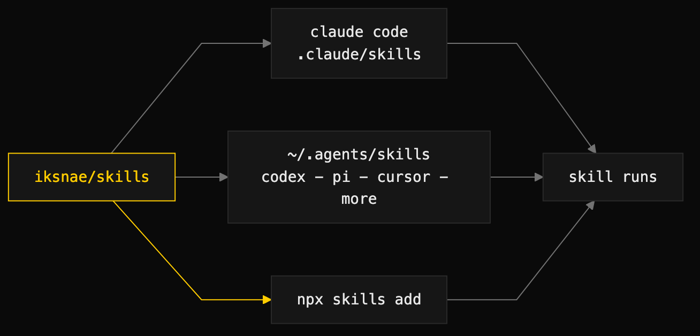

# iksnae/skills


Reusable agent skills and tools — original work, generalized from months of real-world use.

Skills follow the open [Agent Skills standard](https://agentskills.io) (`SKILL.md` + YAML frontmatter) and work with **Claude Code, OpenAI Codex, pi, Cursor, GitHub Copilot, Gemini CLI, opencode, Goose, Amp**, and any other compatible harness.



## Install

```bash
npx skills add iksnae/skills        # universal installer — auto-detects your agents
```

```
/plugin marketplace add iksnae/skills      # Claude Code
/plugin install iksnae-skills@iksnae
```

```bash
npx @iksnae/skills list                    # this repo's own installer
npx @iksnae/skills add certify chaos-qa    # → ~/.claude/skills + ~/.agents/skills
npx @iksnae/skills add --all --project     # → ./.claude + ./.agents
```

Manual: copy any `skills/<name>/` into `~/.agents/skills/` (Codex, pi, Cursor, opencode, Goose, Amp) or `~/.claude/skills/` (Claude Code).

## Skills

Every skill has a full page covering usage, behavior, outputs — and a **real demo run** against [nightjar](docs/demo-nightjar.md), the fictional pastebin built to be inspected, broken, and fixed by these skills.

### Knowledge & analysis

| Skill | What it does |
|---|---|
| [certify](docs/certify.md) | Score every code unit across 9 quality dimensions; graded report card plus remediation plan. |
| [repo-audit](docs/repo-audit.md) | Read-only health and due-diligence audit of an unfamiliar repository. |
| [market-scout](docs/market-scout.md) | Comparative research with adversarial fact-checking and a weighted, cited scorecard. |
| [retrospective](docs/retrospective.md) | Evidence-only retrospectives — every claim cites a commit, run, or issue. |

### Engineering practice

| Skill | What it does |
|---|---|
| [development-loop](docs/development-loop.md) | Language-agnostic plan → implement → review → refactor loop with clean-code discipline. |
| [tree-shaking](docs/tree-shaking.md) | Shrink binaries and bundles — measure, diagnose, pull the right dead-code/packaging lever, prove the win. Language specialties (Swift, Go, JS/TS) under one skill. |
| [docctor](docs/docctor.md) | Author Apple DocC documentation — symbol comments, `.docc` catalogs, Topics curation, tutorials, and static hosting to GitHub Pages. |

### Review & cleanup

| Skill | What it does |
|---|---|
| [grumpy](docs/grumpy.md) | Skeptical senior review — finds where code, plans, or APIs will hurt later; severity-ranked smells with fixes and named test gaps. |
| [janitor](docs/janitor.md) | Disciplined, behavior-preserving cleanup — the smallest safe patch that makes the next change less scary; pairs with grumpy. |

### QA & red-teaming

| Skill | What it does |
|---|---|
| [chaos-qa](docs/chaos-qa.md) | Adversarial chaos GameDays: inject faults, observe, file findings with repro. |
| [dogfood-qa](docs/dogfood-qa.md) | Exercise an app end-to-end as a real user following its own docs. |
| [surface-consistency-audit](docs/surface-consistency-audit.md) | Cross-check the same fact across CLI, API, and web surfaces; classify the drift. |

### Media generation

| Skill | What it does |
|---|---|
| [image-generate](docs/image-generate.md) | Brand-aware image generation with receipts — this README's heroes are its output. |
| [illustrate-doc](docs/illustrate-doc.md) | Decide whether a document deserves illustration, then orchestrate the media skills. |
| [article-audio](docs/article-audio.md) | Narrated audio from a markdown article, with pronunciation config. |
| [spoken-updates](docs/spoken-updates.md) | Toggleable, configurable spoken agent progress updates via non-blocking native TTS. |
| [remotion-author](docs/remotion-author.md) | Author Remotion video specs in a lintable blueprint format. |
| [remotion-render](docs/remotion-render.md) | Render Remotion compositions with receipts; bundles the spec linter. |
| [remotion-with-image](docs/remotion-with-image.md) | Composite flow: generated stills inside Remotion videos. |

### Ambient & presence

[](docs/familiar.md)

| Skill | What it does |
|---|---|
| [familiar](docs/familiar.md) | A cross-harness ambient desktop pet that reacts to your agent's activity — semantic events → a pure reducer → renderer-agnostic pets (macOS overlay or terminal). |

## The demo: nightjar


[nightjar](docs/demo-nightjar.md) is a small Go terminal pastebin that exists to be demonstrated on. The skills in this repo audited it, chaos-tested it (finding ~19% silent write loss under concurrency), dogfooded it (hitting a documented-but-missing `nj rm`), fixed it through the development loop, picked its v2 storage engine, and produced its launch imagery, narration, and title-card spec. [Read the whole arc.](docs/demo-nightjar.md)

## Layout

```
skills/<name>/SKILL.md     # one directory per skill (Agent Skills standard)
docs/<name>.md             # full page per skill, with demo
docs/demos/                # real artifacts from the demo runs
demo/nightjar/             # the fictional project the demos run against
.claude-plugin/            # Claude Code marketplace + plugin manifests
bin/cli.mjs                # npx installer
```

## Portability notes

- Skills are written to be **model-invoked by their `description`** — no harness-specific invocation required.
- Claude-specific frontmatter (`allowed-tools`, slash-command hints) is advisory; other harnesses ignore it safely.
- `market-scout` bundles an optional Claude Code Workflow script; the skill works without it everywhere else.
- Media skills shell out to bundled Python scripts in each skill's `scripts/` dir and read credentials from environment variables (`OPENAI_API_KEY`) — harness-agnostic.

## License

MIT © iksnae
