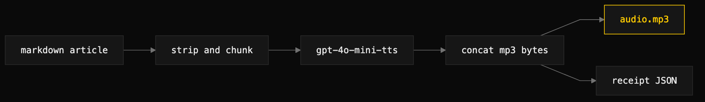

# article-audio

> Generate a spoken-word audio.mp3 from a markdown article via OpenAI TTS, with a receipt beside it.



## What it does

Reads a markdown article, strips frontmatter and formatting, chunks the text on
paragraph boundaries to stay under OpenAI's per-call limit, calls
`v1/audio/speech` with `gpt-4o-mini-tts`, and concatenates the resulting MP3
bytes into one `audio.mp3` next to the article. The byte-concatenation plays
without an audible seam in browsers, so a multi-chunk article reads as one take. A receipt
JSON records char count, chunk count, voice, model, instructions, estimated
cost, and a SHA256 of the plain-text input.

## When to use it (and when NOT to)

Use it for long-form articles or documentation posts that benefit from a "listen
to this" reader on a site. It replaces the browser-native `speechSynthesis`
fallback, which cuts off long text (~250 chars in Chrome) and sounds worse.

Do not use it for short notes (≤150 words do not warrant the cost or the
listener's time), for live realtime narration (use a streaming TTS), or for
translation — the model reads the input language only.

## Install

```
/plugin marketplace add iksnae/skills
npx skills add iksnae/skills
npx @iksnae/skills add article-audio
cp -R skills/article-audio/ ~/.agents/skills/
```

## Requirements

- `OPENAI_API_KEY` — required. The tool exits 2 before any work if it is
  missing; nothing partial is written. No other credentials are read.
- `python3` — runs the bundled `scripts/generate_article_audio.py`.
- A `--config` pronunciation YAML is optional; it needs `pyyaml` if used.

## How it runs

1. **Generate**, resolving the script relative to the skill directory:
   ```bash
   python3 <skill-dir>/scripts/generate_article_audio.py \
     --md docs/<date>-<slug>.md \
     --out /tmp/sample.mp3 \
     --voice echo
   ```
   Key flags: `--out` (defaults to `audio.mp3` next to `--md`), `--voice`
   (default `echo`; 11 stock voices available), `--model` (default
   `gpt-4o-mini-tts`; `tts-1`, `tts-1-hd` alternatives), `--instructions` for
   voice steering, `--config` for a pronunciation map, `--no-pronunciations`,
   `--max-chars-per-chunk` (default 4000), `--speed` (default 1.0). For
   publishing, point `--out` at the article's page bundle so the site template
   picks the MP3 up on the next build.
2. **Verify.** Confirm the MP3 exists and is non-trivial in size (roughly 1 MB
   per minute at 128 kbps), the receipt's `estimated_cost_usd` matches
   expectation, and that for long articles `chunk_count > 1` with per-chunk
   durations proportional to char counts. Spot-listen across a chunk boundary —
   the concatenation should be inaudible.

Pass `--instructions` (for example, "measured, slightly low cadence, technical
tone, no theatrics") for any article over ~600 words of dense technical content,
or the default voice reads brighter than terse prose tolerates.

## Output

- `audio.mp3` at the resolved `--out` path. MPEG ADTS layer III, 128 kbps,
  24 kHz mono.
- `audio.mp3.receipt.json`, schema `article-audio-receipt-v1`. Fields include
  `wall_seconds`, `md_path`, `out_path`, `out_size_bytes`, `model`, `voice`,
  `format`, `speed`, `instructions`, `char_count`, `chunk_count`, per-chunk
  metadata, `estimated_cost_usd`, `plain_sha256`, and `pronunciations_applied`.

Cost shape: `gpt-4o-mini-tts` runs about $12 per 1M input chars — a 1500-word
post (~8500 chars) is roughly $0.10. The `plain_sha256` is the stable identity;
reuse the existing MP3 on an unchanged republish rather than paying again.

## Demo

A ~150-word fictional launch note,
[demos/nightjar-launch-note.md](demos/nightjar-launch-note.md), was read with the
cheapest model the script offers (`gpt-4o-mini-tts`) and the default neutral
`echo` voice. The steering instruction was "measured, slightly low cadence,
technical tone, no theatrics, no exclamation".

The run produced [demos/nightjar-launch-note.mp3](demos/nightjar-launch-note.mp3)
(840 KB). The receipt reported 770 chars, 1 chunk, `duration_sec: 10.0`, and
`estimated_cost_usd: 0.0092` — about nine tenths of a cent. Because it fit in a
single chunk, there was no concatenation seam to check. It succeeded on the first
attempt.

Full report: [demos/media-skills-nightjar.md](demos/media-skills-nightjar.md)
