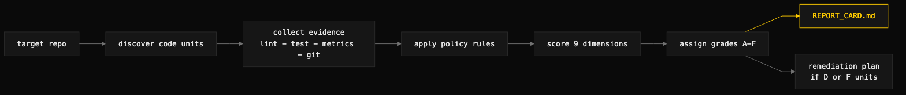

# certify

> Grades every code unit in a repository across 9 quality dimensions and produces a report card with a prioritized remediation plan.



## What it does

`certify` runs a code certification pipeline against a repository: it discovers every certifiable code unit (Go functions, methods, and type declarations; TypeScript/Vue files and components), collects evidence from multiple sources (lint, tests, complexity metrics, AST structure, git history), evaluates policy rules against that evidence, and scores each unit on a 0.0–1.0 scale across nine dimensions — correctness, maintainability, readability, testability, security, architectural fitness, operational quality, performance, and change risk. A weighted average yields a letter grade (A through F) and a certification status per unit, rolled up into a repository report card. If any unit lands at D or F, it also writes a prioritized remediation plan grouped by root cause, effort, and projected impact.

The skill replicates a `certify` CLI tool's pipeline using the agent as the analysis engine, with direct tool access to the codebase. It supports Go and TypeScript/Vue codebases.

## When to use it

- After completing a major refactoring phase, to measure what it bought you.
- Before a release, as a quality gate with explicit numbers behind it.
- When you want the worst code units found and ranked, not just listed.
- When "what's the quality score?" needs an answer backed by evidence rather than impression.

When NOT to use it: for a quick read-only overview of an unfamiliar repo (use `repo-audit` — it is faster and does not run the toolchain), for reviewing a single diff or PR, or on codebases outside Go and TypeScript/Vue, where unit discovery is not defined.

## Install

```
/plugin marketplace add iksnae/skills
npx skills add iksnae/skills
npx @iksnae/skills add certify
# or copy skills/certify/ into ~/.agents/skills/
```

## How it runs

1. **Identify the target** — detect Go (`go.mod`) or TypeScript (`package.json`), read any existing `.certification/config.yml` for scope patterns.
2. **Discover code units** — parse non-test sources into units with IDs like `go://internal/store/store.go#Add`, skipping `vendor/`, `node_modules/`, `testdata/`, and test files.
3. **Collect evidence** — lint (`golangci-lint` / ESLint), tests (`go test -json` / Vitest), complexity and size metrics, structural AST analysis (param counts, nesting, ignored errors, panics, `os.Exit`, defer-in-loop), and git history (churn, contributors, age).
4. **Evaluate policy rules** — thresholds such as complexity ≤ 15 (error), function length ≤ 80 lines (warning), no panics or ignored errors (error).
5. **Score 9 dimensions** — each starts at 1.0 with evidence-based penalties (e.g. −0.25 per test failure on correctness, −0.30 on testability if the package has no tests).
6. **Assign grades and status** — weighted average maps to A–F; status is `certified`, `certified_with_observations`, `probationary`, or `decertified`.
7. **Write the report card** — `.certification/REPORT_CARD.md` with per-unit scores, grade distribution, and top issues.
8. **Generate a remediation plan** (if D/F units exist) — prioritized by severity, grouped by root cause, with S/M/L effort estimates and projected grade impact.

## Output

`.certification/REPORT_CARD.md` (plus `badge.json` and, when needed, `specs/remediation-plan.md`). From the nightjar run:

```markdown
**Overall Grade:** 🟢 **A− (91.2%)**
**Pass Rate:** 100% (20/20 units at grade B or above)

| Unit | Grade | Score | Issue |
|------|:-----:|------:|-------|
| `server.go#handleIndex` | B | 82.0% | Stale paste count bug: header renders
  `s.indexCount` (cached once in `New`) while the table renders a fresh `Load()` |
```

## Demo: nightjar

The skill was run against nightjar, a small Go terminal pastebin (`demo/nightjar` — single binary, stdlib only, JSON-file store). It discovered 20 code units across three packages, ran `go build` / `go vet` / `golangci-lint` / `go test -cover`, and graded the repo **A− (91.2%)** with a 100% pass rate — every unit at B or above, none probationary or decertified.

The grades are not the interesting part; the per-unit issues are. Despite the clean toolchain output (zero lint issues, all tests passing), the certification surfaced three genuine bugs: a stale paste count in the web index (`handleIndex` renders a count cached once at startup while the table renders live data), an unsynchronized read-modify-write in `store.Add` that can silently drop pastes under concurrent POSTs, and a latent nil-dereference in `newID` if `crypto/rand` fails. It also flagged the structural outlier — `handlePastes` at cyclomatic complexity ≈ 18 against the 15 threshold, with the same error-response boilerplate repeated ten times — and a repo-level finding that the README documents an `nj rm` command that does not exist.

The remediation plan priced the fixes: P1 alone (the three correctness bugs plus the README drift) lifts the repo to ≈ 92.7%, and adding server test coverage — the package sitting at 0.0% — takes it to ≈ 95%, a solid A. Full report: [demos/certify-nightjar.md](demos/certify-nightjar.md)
