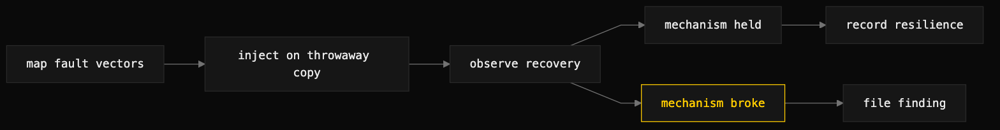

# chaos-qa

> Inject controlled failures into an app's real dependencies and check the resilience it claims actually holds.



## What it does

chaos-qa runs an adversarial GameDay against a running application. Surface-consistency QA asks whether the surfaces agree; behavioral dogfood QA asks whether the happy path works. chaos-qa asks what breaks when a dependency fails, and whether the retries, timeouts, fallbacks, idempotency, and locks the app advertises hold under stress.

Cloud chaos toolkits (Chaos Mesh, Gremlin, Toxiproxy, AWS FIS) are k8s and cloud oriented. The method here is the same hypothesis-inject-observe loop, but the fault vectors are whatever the target actually depends on: upstream APIs, data stores and append-only logs, the filesystem, network reachability, concurrent access, and on-disk locks. You discover the dependency surface first, then inject faults with config edits, fault-injecting test doubles, proxies, and direct file or process manipulation. No cluster required.

It is the failure-injection member technique of [dogfood-qa](dogfood-qa.md).

## When to use it (and when NOT to)

Use it when the happy path already works and you need to know what happens when a dependency degrades — a corrupt store, a dead upstream, concurrent writers, a held lock, a slow client. Use it to prove a resilience mechanism is real before you rely on it, and to pin that proof against future regression.

Do not use it for read-model truth-checking — that is [surface-consistency-audit](surface-consistency-audit.md). Do not use it for happy-path behavioral QA — that is [dogfood-qa](dogfood-qa.md). chaos-qa is specifically about failure injection.

## Install

```
/plugin marketplace add iksnae/skills
npx skills add iksnae/skills
npx @iksnae/skills add chaos-qa
# or copy skills/chaos-qa/ into ~/.agents/skills/
```

## How it runs

1. **State the steady state.** Name the resilience mechanism that should hold.
2. **Discover the fault vectors.** Map what the app talks to and where it keeps state, then design one injection per dependency. Find the command or path that actually exercises the dependency — a deterministic state advance can "succeed" against a dead endpoint because it never calls it.
3. **Inject the failure** on a throwaway copy. Blast radius is everything: never inject into a production environment, real user data, or a connected live remote.
4. **Observe.** Does it recover gracefully, park and surface for attention, fail loud, hang, crash, or corrupt state? Wrap every external or network vector in a timeout — a hang is a finding.
5. **Analyze and file.** A break files an issue via dogfood-qa's finding contract; a hold is recorded as a validated mechanism so a regression is noticeable.

## Output

A GameDay report: per vector, the hypothesis, the injected failure, the observed behavior, and a verdict of held or broke. Breaks graduate to issues; holds are recorded as validated resilience. From the nightjar run, the concurrency vector:

```
50 writers → list reports: 44 pastes        (6 lost, valid JSON)
frequency over 20×40-writer runs:
   corrupted runs: 1/20  (~5%)
   total lost updates across the 19 valid runs: 145   (~7.6 lost/run, ~19%)
```

## Demo: nightjar

Run against [demo/nightjar](demo-nightjar.md), the skill first mapped the dependency surface from source: no network upstreams, no external services — the entire surface is the local filesystem plus concurrent access to a single `pastes.json`. That narrowed the vectors to data-file corruption, torn writes, a missing file, concurrent writers, and slow HTTP clients. macOS has no `timeout(1)`, so every command ran under a perl `alarm`-based shim that exits 124 on hang.

The headline came from the concurrency vector. With 40 to 50 parallel `nj add` processes, roughly 19% of concurrent adds vanished — and the losing writers still printed an id and exited 0, reporting success while a racing read-modify-write clobbered them. About 5% of bursts corrupted the store outright, when two non-atomic `os.WriteFile` calls interleaved and left trailing-byte garbage. A separate vector showed a single torn trailing write made all three stored pastes unreadable, including the two intact records before it, because the store is one JSON document with zero torn-trailing tolerance.

Not everything broke. Corruption failed loud rather than silently-wrong — `list`, `get`, and `add` all exited 1, the HTTP server returned clean 500s and recovered once the file was valid, and the 5-second `ReadTimeout` cleanly bounded an idle connection with no hang. Those holds were recorded as validated resilience. Full report: [demos/chaos-qa-nightjar.md](demos/chaos-qa-nightjar.md)
