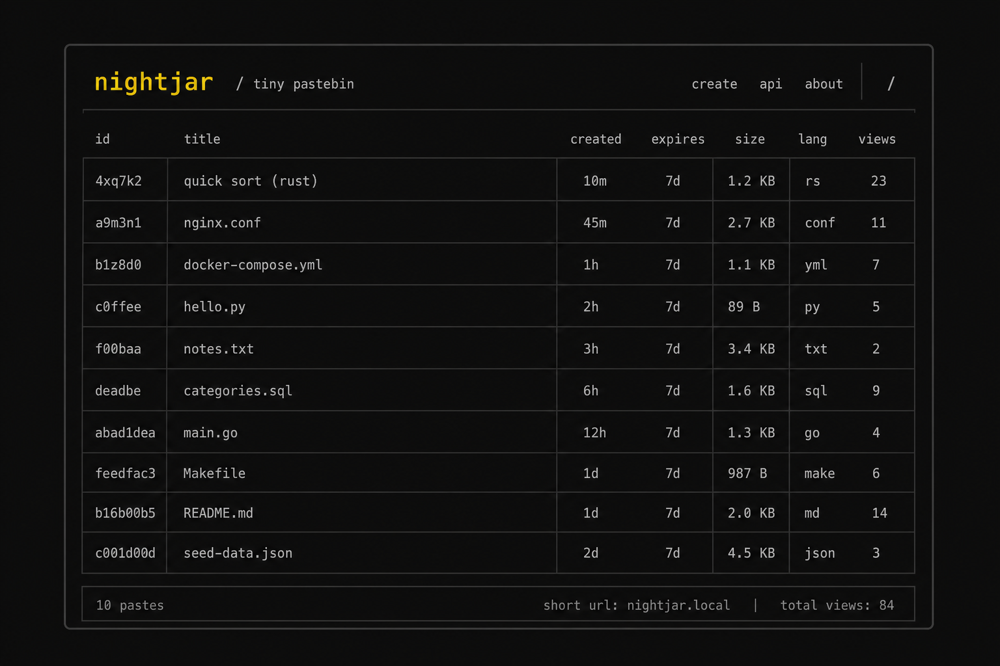
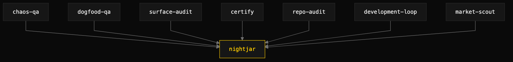

# The demo world: nightjar

> One small, real, runnable codebase that every skill in this repo is demonstrated against.

## What nightjar is

nightjar is a fictional terminal pastebin, written in Go and living at [`demo/nightjar`](https://github.com/iksnae/skills/tree/main/demo/nightjar). It is deliberately small: an `nj` CLI with `add`, `list`, `get`, `rm`, and `serve`; an HTTP JSON API (`GET`/`POST /api/pastes`, `GET`/`DELETE /api/pastes/{id}`); a web index page; and durable state in a single `pastes.json` file on disk. One binary, no external dependencies.

It exists so the skills in this repo have a shared target. Rather than demonstrate each skill against a different toy, every QA, engineering, and media skill runs against this one codebase — so the demos compose, cross-reference, and tell a single coherent story instead of fourteen disconnected ones.

nightjar was built in six commits with realistic flaws seeded on purpose: a count cached at server startup, snippet logic triplicated across surfaces with different limits, validation that lives only in the HTTP handler, and an unlocked read-modify-write store. The skills found those — and they also found genuine unplanned bugs nobody planted: a snippet truncation that splits UTF-8 mid-rune into mojibake, a latent path that leaks the server's absolute filesystem path in a 500 response, and a torn trailing write that bricks an entire JSON store. Real flaws, found by running the product.

## The arc

The demos form a chain, not a list. The QA skills ran first: [dogfood-qa](dogfood-qa.md) drove nightjar like a first-time user and hit a wall at the README's fifth line — `nj rm <id>` was documented but the command did not exist on any surface. That became the top finding.

[development-loop](https://github.com/iksnae/skills/tree/main/skills/development-loop) then implemented the missing delete capability as a vertical slice through store, CLI, and API in three test-driven commits — `store.Remove(id)` with an `ErrNotFound` contract, the CLI `rm` command with correct exit codes, and `DELETE /api/pastes/{id}` returning 204/404/405 — and its review step caught the JSON error-response idiom repeated eight times, extracting one `writeJSONError` helper and netting about thirty lines out of `server.go`.

Looking ahead to v2, [market-scout](https://github.com/iksnae/skills/tree/main/skills/market-scout) evaluated four embedded storage engines for the store nightjar is outgrowing and ranked bbolt first at 51 of 55 (92.7%), ahead of modernc.org/sqlite, the incumbent flat JSON file, and Pebble — the one engine scoring at or near the top on both heaviest-weighted criteria, zero-cgo and concurrent-write safety, without operational baggage.

## Demo artifacts

Every artifact below lives in [`docs/demos/`](demos/) and was produced by a real run on 2026-06-11.

| Artifact | Skill | What it is |
|---|---|---|
| [dogfood-qa-nightjar.md](demos/dogfood-qa-nightjar.md) | dogfood-qa | End-to-end behavioral QA; 8 findings filed, including the missing `nj rm` |
| [chaos-qa-nightjar.md](demos/chaos-qa-nightjar.md) | chaos-qa | GameDay; ~19% silent write loss under concurrency, torn-write brick |
| [surface-consistency-audit-nightjar.md](demos/surface-consistency-audit-nightjar.md) | surface-consistency-audit | Drift report; web header "2 pastes" above a four-row table |
| [certify-nightjar.md](demos/certify-nightjar.md) | certify | Quality report card; overall grade A− (91.2%) |
| [repo-audit-nightjar.md](demos/repo-audit-nightjar.md) | repo-audit | Read-only health and due-diligence audit of the subtree |
| [development-loop-nightjar.md](demos/development-loop-nightjar.md) | development-loop | The `nj rm` build in three TDD commits, plus a DRY refactor |
| [market-scout-nightjar.md](demos/market-scout-nightjar.md) | market-scout | Ranked, cited scorecard for the v2 storage engine; bbolt 51/55 |
| [retrospective-nightjar.md](demos/retrospective-nightjar.md) | retrospective | Evidence-only retrospective of the 6-commit build, every claim cites a SHA |
| [media-skills-nightjar.md](demos/media-skills-nightjar.md) | media skills | Dogfood run of image-generate, article-audio, remotion-author, remotion-render |
| [nightjar-launch-note.md](demos/nightjar-launch-note.md) | article-audio | The nightjar v0.1 launch note (article source) |
| [nightjar-launch-note.mp3](demos/nightjar-launch-note.mp3) | article-audio | Narrated audio of the launch note (OpenAI TTS) |
| [nightjar-launch-note.mp3.receipt.json](demos/nightjar-launch-note.mp3.receipt.json) | article-audio | TTS receipt for the narration |
| [nightjar-title-card.spec.md](demos/nightjar-title-card.spec.md) | remotion-author | Remotion composition spec for the nightjar title card |
| [component-registry.md](demos/component-registry.md) | remotion-author | Component registry backing the title-card spec |

