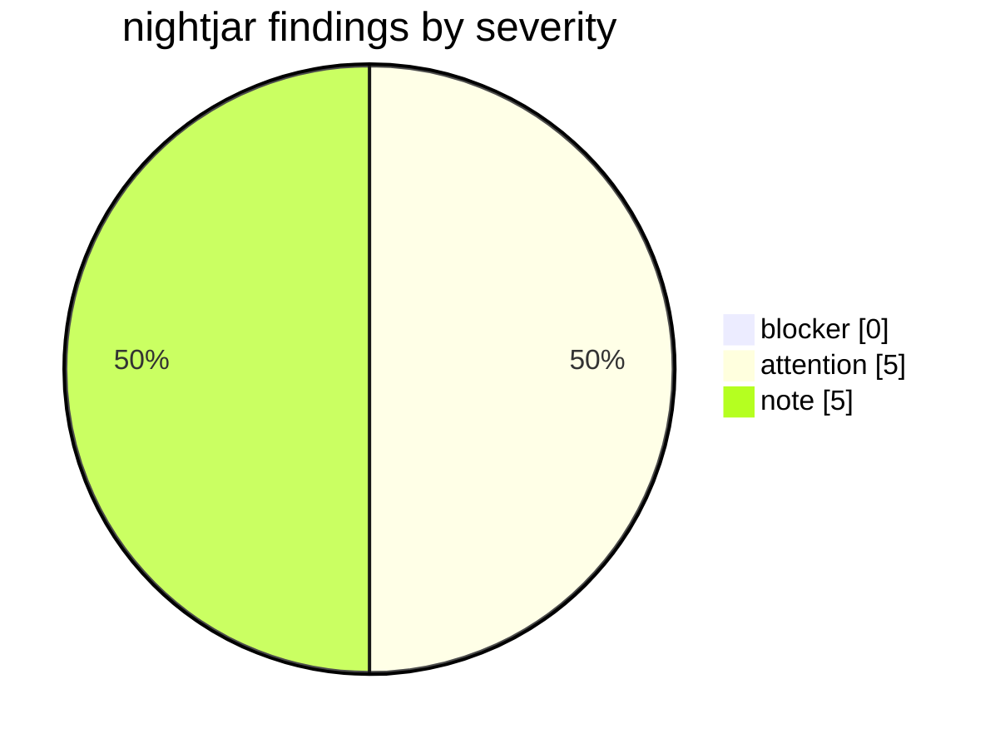

*Produced by the `repo-audit` skill (read-only health audit). Target: the `demo/nightjar` subtree of `iksnae/skills`. Date: 2026-06-11. Findings are observation-derived from a local checkout — no remediation was performed.*

# Repository Audit — nightjar

| Field | Value |
|---|---|
| Repository | iksnae/skills (subtree: `demo/nightjar`) |
| Default branch | main |
| Audit date | 2026-06-11 |
| Scope | Dogfood demo audit of the nightjar terminal-pastebin subtree |

This audit is read-only — no code changes were proposed in this document.

## Summary

nightjar is a single-binary Go terminal pastebin (CLI + HTTP API + web index page) that persists pastes as one JSON file on disk, living as a self-contained module inside the `iksnae/skills` repo. Posture: **has-gaps** — the code builds, vets, and tests clean with no blockers, but documentation drift, an absent CI gate, a stale-counter UI defect, and an unguarded read-modify-write store warrant attention. The single most important step is to add a CI workflow that runs `go build`/`go vet`/`go test` so the green local state is actually enforced (F-build-1, F-tests-1).

## Findings by domain

### Dependencies

| ID | Severity | Finding | Evidence |
|---|---|---|---|
| F-deps-1 | note | Zero external dependencies; standard library only, declared against a current Go toolchain (1.24). No lockfile is expected or needed. Module path is nested under the parent repo. | `demo/nightjar/go.mod:1-3` (single `module`/`go` block, no `require`) |

### Build + CI

| ID | Severity | Finding | Evidence |
|---|---|---|---|
| F-build-1 | attention | No CI anywhere in the repository — `.github/` does not exist, so nothing enforces build/test/vet on change. The README prescribes `go test ./...` / `go vet ./...` as "Development" steps but they are unenforced. | `ls .github/workflows/` → "No such file or directory"; `demo/nightjar/README.md:52-56` |

### Documentation

| ID | Severity | Finding | Evidence |
|---|---|---|---|
| F-docs-1 | attention | README drift: the Usage section documents `nj rm <id>  # delete a paste`, but `main.go` has no `rm` case and `store.go` has no `Delete` method. Running `nj rm <id>` hits the `default` branch, prints `nj: unknown command "rm"`, and exits 2. | `demo/nightjar/README.md:21` vs `cmd/nj/main.go:23-35` (switch: add/list/get/serve only); grep for `Delete` in sources returns no implementation |
| F-docs-2 | note | Aside from the `rm` drift, the README is informative and accurate — covers install, CLI usage, storage location/env override, and the HTTP API with working `curl` examples. | `demo/nightjar/README.md:1-56` |

### Tests

| ID | Severity | Finding | Evidence |
|---|---|---|---|
| F-tests-1 | attention | Test coverage is uneven. The `store` package is well-covered (5 table-style tests; `go test ./...` passes), but `internal/server` (the most logic-dense file — routing, JSON/raw body handling, status codes) and `cmd/nj` have zero tests. | `go test ./...` → `internal/server [no test files]`, `cmd/nj [no test files]`, `store ok`; `internal/store/store_test.go:11-111` |

### License + governance

| ID | Severity | Finding | Evidence |
|---|---|---|---|
| F-license-1 | note | No LICENSE inside `demo/nightjar`, but the parent repo root carries MIT (`Copyright (c) 2026 iksnae`), which covers the subtree. No CODEOWNERS exists, acceptable for a single-author demo. | `head -3 LICENSE` → "MIT License"; no `.github/CODEOWNERS` |

### Code health

| ID | Severity | Finding | Evidence |
|---|---|---|---|
| F-code-1 | attention | The web index header shows a stale paste count. `server.New` caches `indexCount` once at startup, and `handleIndex` renders that cached value in the `<h1>` while the table rows are built from a live `store.Load()` — so after any add the header count and the row count diverge until restart. | `internal/server/server.go:24-27` (cache at New), `:166` (`{{.Count}}` uses `indexCount`), `:187-205` (rows use live `pastes`) |
| F-code-2 | attention | `store.Add` does a full read-modify-write of the entire JSON file with no locking or atomic rename. The HTTP server handles requests concurrently, so two simultaneous `POST /api/pastes` can both Load, both append, and the later Save wins — silently losing a paste. | `internal/store/store.go:80-91` (Load→append→Save, no mutex); `internal/server/server.go:107` (Add called from a concurrent handler) |
| F-code-3 | note | `store.Get` duplicates Load's read+unmarshal instead of reusing it, and on a missing file returns the raw `os` error rather than `ErrNotFound` — inconsistent with `Load` (treats a missing file as empty) and with the `ErrNotFound` contract `cmdGet` relies on. | `internal/store/store.go:94-109` vs `:49-65`; `cmd/nj/main.go:91-99` |
| F-code-4 | note | Active and clean. All 6 commits are dated 2026-06-11 with a clear linear history (scaffold → CLI → API → web index → list-ordering fix → docs); `go build`, `go vet`, and `go test` all pass. | `git log -- demo/nightjar` (6 commits, 2026-06-11); build/vet/test exit 0 |

### Findings severity matrix

## Prioritized recommendations

1. **Add a CI workflow** — gate the module on `go build` / `go vet` / `go test ./...` so the currently-green state is enforced on every change. Addresses: F-build-1, F-tests-1.
2. **Resolve the `nj rm` drift** — either implement the documented delete command (CLI + `store.Delete`) or remove it from the README. Addresses: F-docs-1.
3. **Fix the stale index count** — render the live paste count in the web index header instead of the value cached at `New`. Addresses: F-code-1.
4. **Guard the store against concurrent writes** — add a mutex (and ideally atomic write-rename) so concurrent HTTP `POST`s cannot lose pastes. Addresses: F-code-2.
5. **Add HTTP handler tests** — cover `internal/server` routing, body handling, and status codes, the largest untested surface. Addresses: F-tests-1.

---

*Audit is observation-only; remediation belongs in separate follow-up work.*
