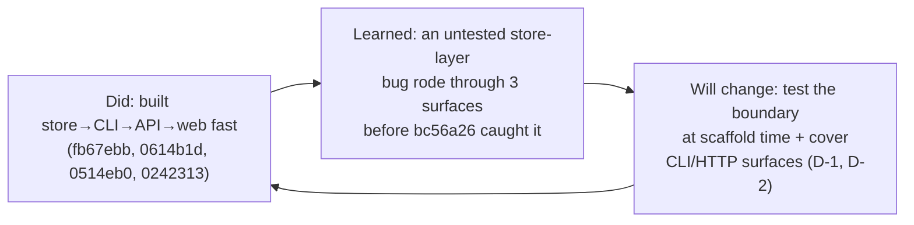

*Provenance: produced by the `retrospective` skill (`skills/retrospective/SKILL.md`) against the nightjar demo build — 6 commits touching `demo/nightjar` — on 2026-06-11. There is no CI or issue tracker for this demo; the record was reconstructed from `git log --stat`, `git show <sha>`, and `go test ./...` output, per the skill's evidence-only discipline. Every claim cites a commit SHA.*

# Retrospective — nightjar build iteration (2026-06-11)

| Field | Value |
|---|---|
| Window | 2026-06-11 13:46 to 2026-06-11 13:47 (EDT) |
| Project | `demo/nightjar` (iksnae-skills) |
| Events analyzed | 6 commits |
| Work items in window | 6 (one per commit; no tracker exists) |

## Summary

The iteration shipped a complete terminal pastebin across six commits — scaffold + store, CLI, HTTP API, web index, an ordering bugfix, and docs (`fb67ebb`, `0614b1d`, `0514eb0`, `0242313`, `bc56a26`, `c0b5c5e`) — all of which landed on `main` with the `store` test suite passing (`go test ./...` → `ok .../internal/store`). Nothing halted; the only failure visible in the record is a list-ordering defect introduced at scaffold and fixed three commits later, plus a stale-counter regression that was introduced and never fixed. The single most actionable drift signal: two of the three production surfaces (`cmd/nj`, `internal/server`) shipped with zero test files, which is why the ordering bug rode through three read surfaces undetected (D-1).

## What shipped

| Work item | Outcome | Stages completed | Notes |
|---|---|---|---|
| `fb67ebb`: scaffold module + store with tests | merged | build, test | `store` package + 207 lines incl. unit tests; introduces the unsorted `Load` (see D-2). |
| `0614b1d`: nj CLI — add/list/get | merged | build | 96-line CLI; no test files added (D-1). |
| `0514eb0`: HTTP API + serve command | merged | build | 142-line `server` package + `serve` subcommand; no test files added (D-1). |
| `0242313`: web index page | merged | build | HTML index via `html/template`; introduces cached `indexCount` (see D-3). |
| `bc56a26`: fix list ordering — newest first | merged | build, test | Adds `sort.Slice` in `store.Load` + `TestLoadNewestFirst`; central one-point fix for D-2. |
| `c0b5c5e`: README + usage docs | merged | docs | 56-line README; documentation only. |

## What halted

| Work item | Halt stage | Reason | First halt evidence |
|---|---|---|---|
| — | — | No work item halted or was blocked within the window. | n/a |

The record shows no abandoned, reverted, or blocked commits. The ordering defect (D-2) was a shipped-then-corrected bug, not a halt.

## Drift signals

| ID | Signal | Frequency | Evidence | Improvement candidate |
|---|---|---|---|---|
| D-1 | Production read/serve surfaces shipped without any tests | 2 packages | `go test ./...` reports `[no test files]` for `cmd/nj` and `internal/server`; surfaces added in `0614b1d` (CLI), `0514eb0` (API), `0242313` (web) carried no test files | Add handler-level tests for `internal/server` and a CLI smoke test for `cmd/nj`. |
| D-2 | A single store-layer defect propagated across every read surface before being caught | 4 commits / 3 surfaces | Unsorted `Load` introduced in `fb67ebb`; consumed unchanged by `0614b1d` (`cmdList`), `0514eb0` (API list), `0242313` (web index); fixed centrally in `store.Load` at `bc56a26`, which also adds the first ordering test | Assert store-boundary invariants (ordering) in `store` tests at scaffold time, before consumers are built. |
| D-3 | Divergent disk-read paths in the store let derived state go stale | 2 occurrences | `store.Get` in `fb67ebb` re-implements its own `ReadFile`+`Unmarshal` instead of calling `Load`, so the `bc56a26` sort fix never reaches it; `0242313` caches `indexCount` from a one-time `New`-time `Load()`, so the web index header count diverges from the live row count after any paste is added while the server runs | Funnel all reads through `Load`; compute the index count per-request rather than caching at startup. |

## Escalations + needs-attention

| Work item | Type | Action required |
|---|---|---|
| `0242313`: web index page | latent correctness bug | The index header renders `{{.Count}}` from `indexCount`, primed once in `New` (`pastes, _ := st.Load()`), while the table renders rows from a live `Load()`. After any POST to `/api/pastes` the header count and the row count disagree for the life of the process. Introduced in this window, never fixed (D-3). |
| `cmd/nj`, `internal/server` | test coverage gap | Two of three surfaces have no tests; regressions here are invisible to `go test` (D-1). |

## Improvement candidates

1. **Test the CLI and HTTP surfaces** — addresses D-1. Acceptance: `go test ./...` exercises `internal/server` handlers (list/create/get/404) and `cmd/nj` add→list→get, so neither package reports `[no test files]`.
2. **Pin store invariants at the boundary at scaffold time** — addresses D-2. Acceptance: `store` test suite asserts `Load` returns newest-first from the moment `Load` exists, so the ordering defect cannot ship to a consumer.
3. **Single read path + live derived counts** — addresses D-3. Acceptance: `store.Get` reads through `Load` (inheriting its ordering/contract), and the web index computes its paste count per request, so header and rows never diverge.

## The introduce-then-fix arc

The window contains one genuine introduce-then-fix arc, fully evidence-backed:

- **Introduced** at `fb67ebb`: `store.Load` returns pastes in raw file (append) order, and `Add` appends, so the newest paste sinks to the bottom. The scaffold's tests did not cover ordering.
- **Propagated** through `0614b1d` (CLI `list`), `0514eb0` (API `GET /api/pastes`), and `0242313` (web index) — three read surfaces all rendered oldest-first, none caught it.
- **Fixed** at `bc56a26`: a single `sort.Slice(... Created > ...)` in `store.Load`, deliberately placed at the store layer so "every surface gets the fix" (commit message), accompanied by the first ordering test, `TestLoadNewestFirst`.

The arc is the textbook argument for D-2: because the defect lived at a shared boundary with no boundary test (D-1), it shipped to three consumers before correction — and the one-line fix landed in one place precisely because the boundary was shared.

