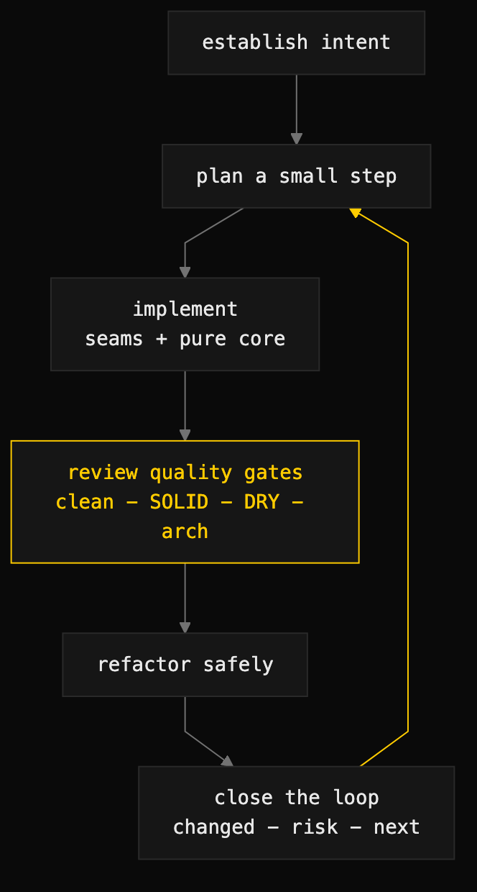

# development-loop

> A stack-agnostic coaching loop — plan a small step, implement along clean seams, review against quality gates, refactor safely, repeat.



## What it does

`development-loop` keeps a coding session moving through small, safe increments while continuously applying Clean Code and Clean Architecture heuristics, pragmatic SOLID and DRY, design patterns only where they reduce complexity, and Strangler-style increments for legacy modernization. It is deliberately language-, framework-, and platform-agnostic: it works in principles, seams, and steps, never stack-specific prescriptions, and it never recommends a big-bang rewrite without an incremental path and a safety net.

Each pass through the loop produces a one-sentence goal, a definition of done, the smallest next change (preferably a vertical slice), implementation guidance at the module/responsibility level, findings from five quality gates, a refactoring plan where the gates found issues, and a closing summary: what changed, what risk remains, the next smallest step.

## When to use it

- Implementing a feature or fix where you want discipline around increment size, test-first contracts, and review built into the work itself.
- Refactoring or untangling code that is hard to test, heavily coupled, or living in bloated files.
- Modernizing legacy systems — the loop defaults to Strangler-pattern increments: wrap a stable boundary, route through a facade, move one vertical slice at a time, retire the old slice only after parity is established.

When NOT to use it: pure research or analysis tasks with no code change, situations where you genuinely want a from-scratch rewrite and accept the risk, or when you need stack-specific library and framework recommendations — the loop stays neutral unless asked.

## Install

```
/plugin marketplace add iksnae/skills
npx skills add iksnae/skills
npx @iksnae/skills add development-loop
# or copy skills/development-loop/ into ~/.agents/skills/
```

## How it runs

1. **Establish intent** — at most 5 questions: the outcome, the constraints, where the pain is, the current boundary, the smallest shippable slice.
2. **Plan a small step** — one-sentence goal, definition-of-done checklist, smallest next change, rollback plan if risk is non-trivial.
3. **Implement** — structure recommended at the module/file/responsibility level, with clear seams between pure logic and IO edges.
4. **Review against quality gates** — Clean Code (intent-revealing names, one thing per unit, explicit side effects), SOLID (pragmatic, not dogmatic), DRY (eliminate duplicate knowledge, keep duplication that is likely to diverge), Architecture (dependencies point inward; boundaries testable), Small files/modules (cohesive, no dumping grounds, no over-fragmentation).
5. **Refactor safely** — small steps that keep the system working, with a safety net (tests, characterization, contract checks) and an explicit order of operations.
6. **Close the loop** — what changed (1–3 bullets), what risk remains, the next smallest step. Then back to step 2.

## Output

The loop's artifact is the work itself plus a close-out per iteration. From the nightjar run:

```markdown
- **What changed:** `store.Remove` (tested), CLI `rm` (correct exit
  codes, clear messages), API DELETE (tested, 204/404/405), README row,
  one DRY refactor of the server's error writing.
- **Remaining risk:** `handlePastes` is still one long method routing
  four verbs by hand; fine at this size...
- **Next smallest step:** ...the genuinely next defect-shaped item is
  that `nj get` fails silently on not-found — same fix shape, one line.
```

## Demo: nightjar

The loop was applied to nightjar's top flagged defect: the README documents `nj rm <id>`, but the command does not exist — the CLI rejects `rm` as unknown and the API answers `DELETE` with 405. The plan scoped a vertical slice through all three layers (store, CLI, HTTP API), with a definition of done covering the `ErrNotFound` contract, the project's 0/1/2 exit-code conventions, and `go build && go vet && go test` green between every step.

Three increments followed the loop's shape. The store layer went test-first — three tests written before any implementation, red on `st.Remove undefined`, green on first run. The CLI increment matched existing conventions but made one deliberate, argued divergence: where `get` exits silently on not-found, `rm` prints why it did nothing, because a destructive command should. The API increment started by giving the previously untested server package its first `httptest` cases (204, 404, 405), red-then-green.

The review step is where the loop's DRY gate paid off concretely: it found the JSON error-response idiom repeated **eight times** in `handlePastes` — the new DELETE branch had just added copies seven and eight. That is duplicated knowledge (how this API serializes an error), so the refactor extracted a single `writeJSONError` helper and rewrote all eight sites, net minus ~30 lines, with the new tests as the safety net. End-to-end verification against a live server confirmed create → delete 204 → delete-again 404. Full report: [demos/development-loop-nightjar.md](demos/development-loop-nightjar.md)
