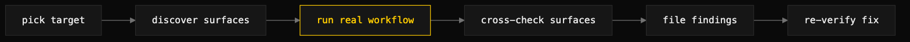

# dogfood-qa

> Run the app end-to-end like a real user, cross-check every surface, and file what leaks.



## What it does

An application's most valuable QA is to run it like a user and watch where it leaks. Reading the code finds the bugs the author can imagine; running the app end-to-end finds the gaps between the parts — the ones that appear only with real state, real data, and real dependencies. dogfood-qa is that pass, made repeatable.

It drives a real workflow against a real target with real dependencies, never fakes. It cross-checks that every presentation surface — CLI, API, web or TUI, and the underlying data — tells the same truth. It files each gap as an issue with a root cause at file:line, a repro, a fix direction, and a verification plan. Then it re-verifies after fixes land: the loop is not done until the finding is confirmed gone against the running system.

It is the counterpart to read-only review. Code review reads structure; dogfood-qa exercises the running product.

## When to use it (and when NOT to)

Use it to QA an application by running it, not reading it — the pass that surfaces duplicated items, onboarding breaks, and surface-versus-surface disagreements that code review misses. It also captures every manual nudge required to reach a ready state, because a nudge means the flow has a hole.

Do not use it for diff or PR review — use a code-review skill. Do not use it for single-feature acceptance or pure code-structure review. For the embedded sub-techniques, see [surface-consistency-audit](surface-consistency-audit.md) and [chaos-qa](chaos-qa.md).

## Install

```
/plugin marketplace add iksnae/skills
npx skills add iksnae/skills
npx @iksnae/skills add dogfood-qa
# or copy skills/dogfood-qa/ into ~/.agents/skills/
```

## How it runs

1. **Target.** Pick the application or a representative end-to-end scenario. Discover its surfaces first — CLI commands, TUI screens, API endpoints, web routes, and where it keeps durable state. Confirm readiness honestly: dependencies reachable, credentials present, remotes connected. Any manual nudge to reach ready is itself a finding.
2. **Exercise.** Drive a full cycle the way a user would, from onboarding through the meaningful outcome, against real dependencies. Walk every web/TUI state and action. Log any friction as you go.
3. **Cross-check the surfaces.** Invoke [surface-consistency-audit](surface-consistency-audit.md): read each load-bearing fact from every surface and flag any disagreement. One error must read as one error everywhere.
4. **Inject failures.** Invoke [chaos-qa](chaos-qa.md) on a throwaway copy to confirm the resilience mechanisms hold — the happy path only proves the happy path.
5. **File findings.** One issue per gap, with root cause, repro, fix direction, regression-test gap, severity, and provenance.
6. **Verify fixes.** Re-run the exact repro against the rebuilt binary. If a closed fix still reproduces, reopen with the precise residual root cause.

## Output

An issue per gap plus an optional run report summarizing the pass. From the nightjar run, the cross-surface count check:

```
| Fact        | CLI       | API         | Web                          | Disk |
| Paste count | 8 pastes  | "count": 8  | header "6 pastes", 8 rows    | 8    |
```

## Demo: nightjar

Run against [demo/nightjar](demo-nightjar.md), the skill followed the README top to bottom as a first-time user: build, add from a file, add from stdin, list, get, then `rm`. The README's fifth usage line was the first hard wall. `nj rm <id>` is documented at `README.md:19`, but the binary rejected it as an unknown command and no surface offered deletion at all — a user following the tour hit a dead end at step five, with pastes permanent. That documented-but-missing command became the top finding and the seed for the development-loop demo.

The surface cross-check caught a page disagreeing with itself: after two API adds, the web index header read "6 pastes" above a table of eight rows, while the CLI, API, and disk all agreed on eight. The count was frozen at server start. The pass also found a UTF-8 snippet truncation that split mid-rune and printed mojibake for any non-ASCII paste, a first-run lookup that leaked a raw filesystem path through a 500, and validation that drifted by surface — the API rejected empty content with a 400 while the CLI happily stored an empty paste.

Eight findings were filed, two high, two medium, four low, each carrying its exact repro for re-verification. The friction log recorded the honest credit too: build, add, list, get, serve, and both documented curl forms all worked first try with zero intervention. Full report: [demos/dogfood-qa-nightjar.md](demos/dogfood-qa-nightjar.md)
