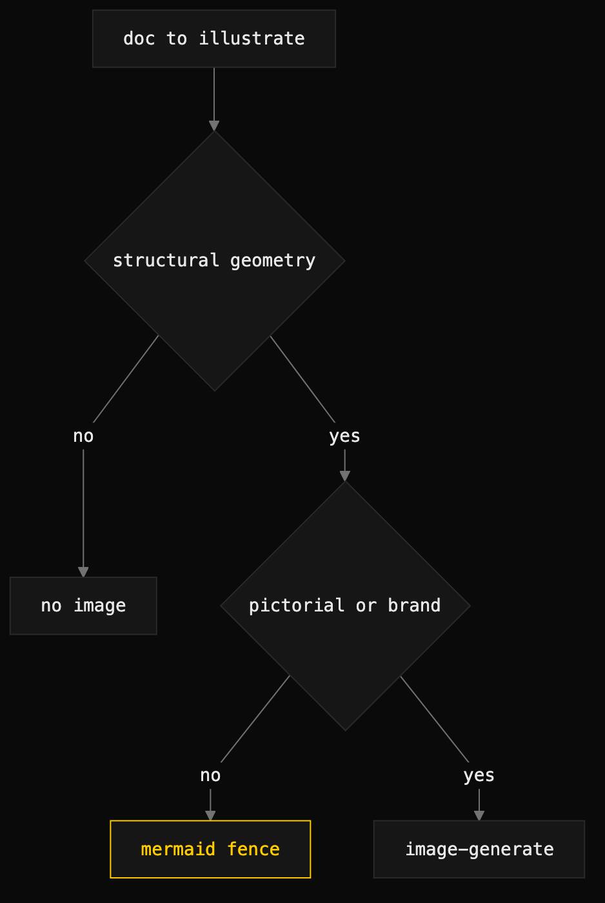

# illustrate-doc

> Decide whether a document needs a diagram, and which tool should produce it.



## What it does

A methodology skill — it produces no artifact. It gives one decision tree for
image vs no-image, and a tool-selection rule that defaults to **Mermaid** (zero
cost, renders natively in GitHub, structurally accurate by construction) and
escalates to `image-generate` only when brand voice or pictorial content is the
load-bearing concern. The cardinal rule: if a concept has structural geometry
that prose has to reconstruct, a diagram pays compounding interest; if it is a
list, a comparison, or a single claim, prose is the right tool.

## When to use it (and when NOT to)

Use it while authoring a doc of ≥400 words that describes a structural concept —
a timeline, phases, dependencies, a hierarchy, a state machine, a comparison
matrix, a decision tree, or swim lanes — to decide whether and how to illustrate
it.

Do not use it to decorate every doc. Most prose deliverables — PR reviews, short
briefs, plain-language summaries — do not need visuals, and image-fatigue is
real. The skill never overrides an author who chooses to ship a long planning
doc without a visual.

## Install

```
/plugin marketplace add iksnae/skills
npx skills add iksnae/skills
npx @iksnae/skills add illustrate-doc
cp -R skills/illustrate-doc/ ~/.agents/skills/
```

## Requirements

None to run the decision itself — it is pure methodology. If the decision lands
on producing an artifact, the chosen downstream skill carries the requirements:
Mermaid needs nothing; `image-generate` needs `OPENAI_API_KEY` and `python3`;
the Remotion path needs Node and `npx`.

## How it runs

1. **Identify the structural concept.** Name aloud the one geometric concept the
   doc most relies on. If you cannot, the doc probably does not need an image.
2. **Walk the decision tree.** Reference prose (PR review, short brief) → no
   image. A planning/synthesis/architecture doc under 400 words → no image. A
   doc with a single structural geometry the prose keeps reconstructing →
   Mermaid. Pictorial content (UI mockup, hero shot, story card) →
   `image-generate`.
3. **Try Mermaid first.** Author the diagram as a ```` ```mermaid ```` fence in
   the doc directly and preview it. If it is legible and the concept comes
   through, you are done — cost zero.
4. **Escalate to image-generate only if needed** — the Mermaid reads off-brand
   for a high-visibility surface, or the concept is pictorial:
   ```bash
   python3 <image-generate-skill-dir>/scripts/generate_image.py \
     --mermaid path/to/diagram.mmd --out docs/assets/<slug>.png
   # or --prompt "<subject>" for a hero
   ```
5. **Review the doc** with the image in place. The image should sit inline with
   the prose that names the concept, not at the bottom as decoration. The final
   call is the author's.

## Output

No file. The output is a decision — illustrate or not, and with which tool — plus
(if the decision is yes and you escalate) the artifact the chosen primitive
writes, with its receipt. The verification bar: any image sits inline with the
naming prose, its geometry matches the prose's claim, and a receipt exists beside
any `image-generate` output.

## Demo

There was no existing run for this skill, so one was created. The skill's
decision framework was applied to `demo/nightjar/README.md` — a ~250-word usage
README with an install block, a CLI command list, and an HTTP API table.

The decision record is
[demos/illustrate-doc-nightjar.md](demos/illustrate-doc-nightjar.md). The verdict
was **no illustration**: the README is reference prose rather than a
planning/architecture doc, it sits under the 400-word gate, and its content is
list- and table-shaped, not geometry the prose keeps rebuilding. The record walks
the full tree and documents the one candidate that was considered and rejected —
a `nj serve` data-flow diagram — on the grounds that adding it would be
Mermaid-as-diagram-filler on the wrong surface. The honest call, faithful to the
skill's own warning against decorating every doc, is to leave the README plain.

Full report: [demos/media-skills-nightjar.md](demos/media-skills-nightjar.md)
