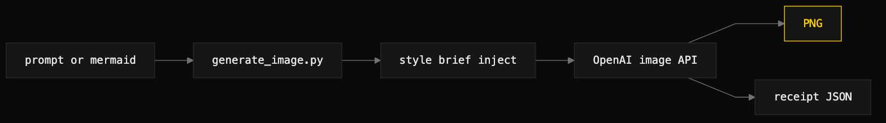
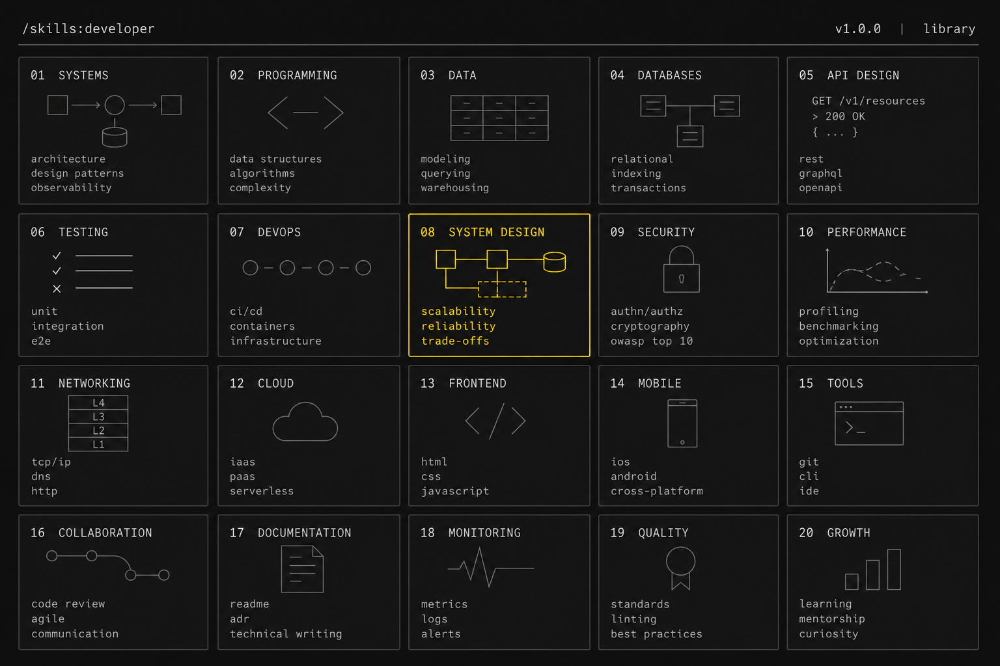
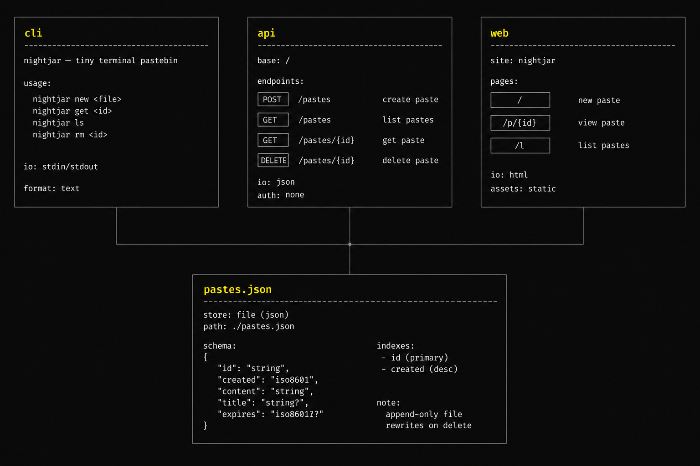
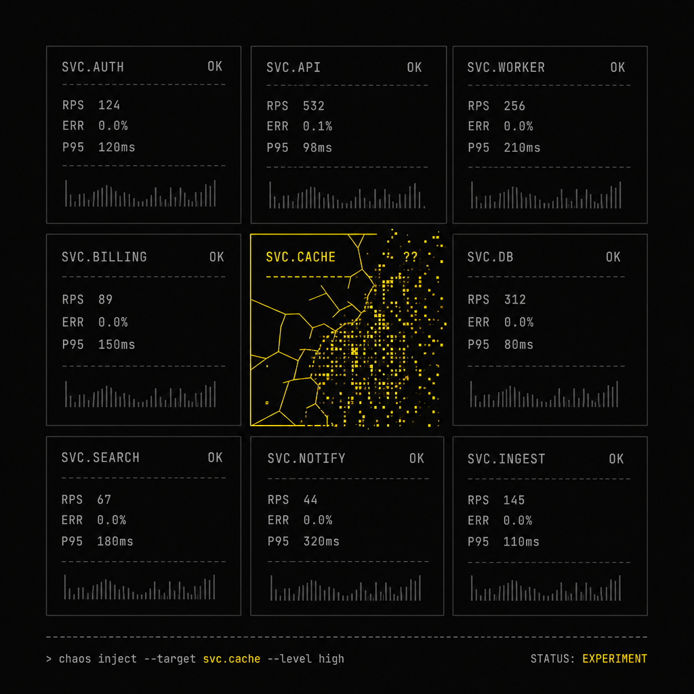
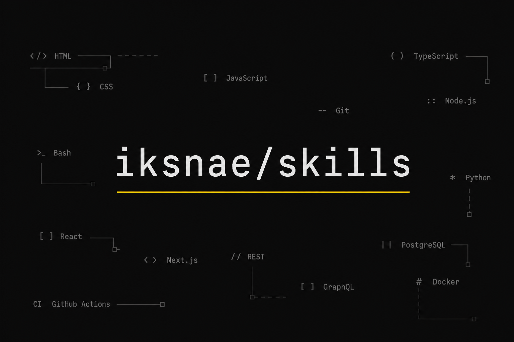

# image-generate

> Turn a text prompt or a Mermaid source into a PNG, with an auditable receipt beside it.



## What it does

Produces a PNG from one of two inputs — a free-text `--prompt` for pictorial
work, or a `--mermaid path.mmd` for structurally accurate diagrams (Kroki, or a
local `mmdc`, renders a deterministic baseline and the image model polishes it).
Every run writes a sibling receipt JSON (`image-gen-receipt-v1`) capturing the
model, size, quality, prompt hash, whether a style brief was injected, and a
cost estimate. If a `DESIGN.md` or `BRAND.md` with an "image voice" section
exists in the working directory, that section is prepended to every prompt so
output reads on-brand.

## When to use it (and when NOT to)

Use it when a deliverable earns a visual a Mermaid block alone cannot carry — a
hero image, a brand-aligned still, or a diagram that needs polish for a
high-visibility surface.

Do not use it for code-flow diagrams that belong in markdown as raw Mermaid (put
them in a `.md` instead), for screenshots of real UI, or when `OPENAI_API_KEY`
is missing. For pure technical diagrams, pass `--no-style` so the brand voice
does not intrude.

## Install

```
/plugin marketplace add iksnae/skills
npx skills add iksnae/skills
npx @iksnae/skills add image-generate
cp -R skills/image-generate/ ~/.agents/skills/
```

## Requirements

- `OPENAI_API_KEY` — required. The tool exits 2 with a clear message if it is
  missing or empty; no other credentials are read.
- `python3` — runs the bundled `scripts/generate_image.py`.
- For `--mermaid` mode: `kroki.io` reachable (default), or a local `mmdc` on
  PATH. Override the endpoint with `--kroki-url`.
- For `--batch` mode: `pyyaml` installed.

## How it runs

1. **Decide the mode.** Structural artifact (nodes, edges, layers, state
   transitions) → `--mermaid`. Pictorial artifact (hero, illustration, concept)
   → `--prompt`.
2. **Author the source.** For Mermaid, write a `.mmd` with terse labels (under
   ~30 chars) and no parentheses inside labels — the parser truncates at the
   first `(`. For a prompt, lead with the subject and state aspect ratio in
   words.
3. **Run the tool**, resolving the script relative to the skill directory:
   ```bash
   python3 <skill-dir>/scripts/generate_image.py --mermaid docs/diagrams/layers.mmd
   # or
   python3 <skill-dir>/scripts/generate_image.py --prompt "..." --size 1536x1024
   ```
   Key flags: `--out`, `--size 1024x1024|1536x1024|1024x1536` (default
   1536x1024), `--quality high|medium|low` (default high), `--model` (default
   `gpt-image-2`), `--no-style`, `--style-file` / `--style-section`, `--batch`
   with `--max-workers`. Exit codes: 0 written, 1 generation failed, 2 operator
   error.
4. **Verify the output.** Open the PNG; check the subject, that every Mermaid
   node and edge survived, and the receipt's `prompt_raw` for paren truncation.
5. **Place the image.** Default outputs land in `generated-images/`. For a
   committed deliverable, move the PNG into a tracked assets directory and update
   references.

## Output

- The PNG at the resolved `--out` path (default `generated-images/<slug>.png`).
- A sibling receipt JSON, schema `image-gen-receipt-v1`. Fields include `model`,
  `size`, `quality`, `prompt_raw`, `prompt_final`, `prompt_hash`,
  `style_injected`, `cost_estimate`, `mode`, and for Mermaid mode the renderer
  used (`mmdc` | `kroki` | none). On failure the wrapper still writes a receipt
  with an `error` field when it can.

Indicative cost (gpt-image-2): 1024×1024 high ~$0.04, 1536×1024 high ~$0.06.

## Demo

This repository's own hero images are the demo. Both were generated from the
repo root, so the style brief auto-injected from `DESIGN.md` → `## Image voice`
(`#FFCC00` on `#0a0a0a`, flat, monospace, no gradients or glow).



The repo hero (`docs/assets/hero-iksnae-skills.png`, 1.37 MB) and the demo hero
(`docs/assets/hero-nightjar.png`, 1.27 MB) both ran at quality `medium`, size
`1536x1024`, model `gpt-image-2`, and succeeded on the first attempt with no
retries. Each receipt confirmed `"style_injected": true` and
`"cost_estimate": 0.03` — combined image spend was about $0.06. The yellow accent
landed on exactly one element in each composition, as the brief asks.

### Gallery

Three more examples, all generated from the repo root at quality `medium`,
model `gpt-image-2`, with the `DESIGN.md` → `## Image voice` brief
auto-injected. Each succeeded on the first attempt.

**Architecture composition** — `demos/example-architecture.png`



```
a technical architecture composition for nightjar the tiny terminal pastebin: three surface panels labeled cli, api, web above one store panel labeled pastes.json, connection lines, monospace labels.
```

Receipt `demos/example-architecture.json`: model `gpt-image-2`, size
`1536x1024`, `"style_injected": true`, `"cost_estimate": 0.03`.

**Concept image** — `demos/example-concept.png`



```
abstract concept image for "chaos engineering": a small dark grid of terminal tiles with one tile fracturing into noise, single #FFCC00 accent on the fractured tile.
```

Receipt `demos/example-concept.json`: model `gpt-image-2`, size
`1024x1024`, `"style_injected": true`, `"cost_estimate": 0.02`.

**Social preview card** — `demos/example-social-card.png`



```
social preview card for the iksnae/skills repository: the text "iksnae/skills" in monospace as the focal point on near-black, thin #FFCC00 underline rule, small scattered skill-name tags in dim gray.
```

Receipt `demos/example-social-card.json`: model `gpt-image-2`, size
`1536x1024`, `"style_injected": true`, `"cost_estimate": 0.03`.

Full report: [demos/media-skills-nightjar.md](demos/media-skills-nightjar.md)
