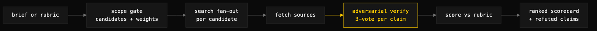

# market-scout

> Comparative research with adversarial fact-checking — ranks N candidates against a weighted rubric and emits a cited scorecard.



## What it does

`market-scout` evaluates and ranks alternatives — tools, models, vendors, libraries, competitors — against an explicit weighted rubric. It fans out web searches per candidate, fetches the sources, puts every load-bearing claim through 3-vote adversarial verification, scores each candidate per criterion, and returns a ranked scorecard with weighted totals, an executive summary, caveats, a refuted-claims list, and citations.

It is a two-layer skill: the SKILL.md is the launcher and scope gate, and the fan-out/verify/score engine is a bundled Claude Code Workflow script (`market-scout.workflow.js`) that runs in the background through Scope → Search → Fetch → Verify → Score phases. Verification defaults to refuting on uncertainty, so a thin-evidence run legitimately returns few confirmed claims — that is signal, surfaced in the caveats rather than padded over.

## When to use it

- Picking or justifying a choice between named alternatives: which LLM drives a pipeline, which library or vendor to adopt, which storage engine to migrate to.
- A competitive landscape scan where the deliverable is a ranking, not a narrative.
- Any decision where the claims behind the ranking need to survive adversarial checking — marketing copy and stale benchmarks get refuted, not repeated.

When NOT to use it: single-topic narrative research with no head-to-head comparison (use a general deep-research approach), or when the request is too vague to score — "compare some databases" fails the scope gate, and the skill asks 2–3 sharp clarifying questions before running anything.

## Install

```
/plugin marketplace add iksnae/skills
npx skills add iksnae/skills
npx @iksnae/skills add market-scout
# or copy skills/market-scout/ into ~/.agents/skills/
```

## How it runs

1. **Scope gate** — before anything runs, confirm the three things a comparison cannot work without: named candidates, criteria with weights in priority order, and constraints (budget, license posture, the incumbent to beat). Missing pieces trigger clarifying questions; a specific request skips straight through.
2. **Run the workflow** — pass a structured `{subject, candidates, criteria}` object (preferred; it pins the rubric) or a free-form brief that the Scope phase derives candidates and a rubric from.
3. **Search fan-out** — web searches per candidate per criterion.
4. **Fetch** — pull the actual sources, not just snippets.
5. **Adversarial verify** — each claim is reviewed by 3-vote adversarial check; uncertain claims are refuted rather than passed.
6. **Score** — each candidate per criterion, weighted totals, ranking.
7. **Deliver** — render the result as a markdown scorecard: frontmatter, subject line, ranked candidate × criterion table, executive summary, caveats, refuted-claims list, and at least 3 cited sources.

## Output

A markdown scorecard (e.g. `research/market-scout/<subject-slug>-<date>.md`). From the nightjar run:

```markdown
| Rank | Candidate | C1 ×3 | C2 ×3 | C3 ×2 | C4 ×2 | C5 ×1 | Weighted | % |
|:---:|-----------|:---:|:---:|:---:|:---:|:---:|:---:|:---:|
| 1 | **bbolt** (`go.etcd.io/bbolt`)  | 5 | 5 | 4 | 4 | 5 | **51** | 92.7% |
| 2 | **modernc.org/sqlite**          | 5 | 4 | 4 | 5 | 4 | **49** | 89.1% |
| 3 | **flat JSON file** (incumbent)  | 5 | 2 | 5 | 5 | 4 | **45** | 81.8% |
| 4 | **Pebble** (`cockroachdb/pebble`) | 5 | 5 | 1 | 3 | 3 | **41** | 74.5% |
```

## Demo: nightjar

The brief: nightjar, a tiny stdlib-only Go terminal pastebin, is outgrowing its flat-JSON-file store — evaluate the incumbent against bbolt, SQLite via `modernc.org/sqlite`, and Pebble for v2. Five weighted criteria, zero-cgo deployment and concurrent-write safety weighted heaviest. The run used live web search with the fan-out → fetch → adversarial-verify → score methodology, every load-bearing claim cited inline.

**bbolt won at 51/55 (92.7%)** — the only candidate near the top on both weight-3 criteria, with ACID transactions, a single-file fixed format, and active etcd-io maintenance. The incumbent flat file placed third at 81.8%, capped by a 2 on concurrent-write safety: no crash-atomic write path beyond a hand-rolled mutex and temp-file rename, which is exactly why the brief said nightjar was outgrowing it.

The adversarial layer earned its keep on Pebble, which ranked last (74.5%) despite top marks on cgo and concurrency. The verification surfaced Cockroach Labs' own statement that Pebble filters every feature "through the criteria of whether it will be useful to CockroachDB, which is a harsh filter for a general purpose key-value storage engine" — refuting the naive "1,000+ importers, battle-tested embedded KV store" reading. Three more claims were refuted or downgraded for transparency, including "modernc.org/sqlite supports concurrent writes" (it inherits SQLite's single-writer model; the working pattern is `SetMaxOpenConns(1)`). Full report: [demos/market-scout-nightjar.md](demos/market-scout-nightjar.md)
