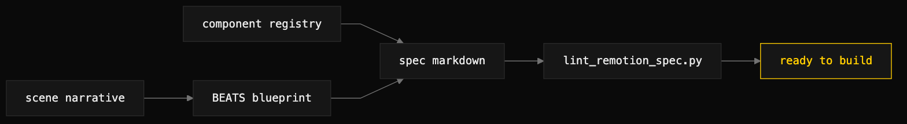

# remotion-author

> Author a Remotion scene spec as an executable BEATS blueprint, then lint it clean.



## What it does

Encodes the "specs are code blueprints, not prose" discipline for authoring
Remotion compositions. Every scene carries a TypeScript `const BEATS` constant
that names each animation event with a frame stamp, and JSX-tagged components in
the spec body must resolve to a `component-registry.md`. The bundled linter
enforces the structural invariants — a BEATS block per scene, monotonic frames,
durations that sum to the total, and component references that resolve — before
any render. The payoff is repeatable, diff-able, lint-able specs the builder
translates rather than interprets.

## When to use it (and when NOT to)

Use it when an agent needs to produce a new Remotion video — a scene file, a
composition entry, or the spec markdown that drives a build.

Do not use it to render the final video (use `remotion-render`), to author
non-Remotion motion graphics, or to write narrative prose specs. The whole point
is that the spec is executable intent, not creative writing; the linter does not
read prose, so an editor pass is still required for tone and pacing.

## Install

```
/plugin marketplace add iksnae/skills
npx skills add iksnae/skills
npx @iksnae/skills add remotion-author
cp -R skills/remotion-author/ ~/.agents/skills/
```

## Requirements

- `python3` — runs the spec linter, which is bundled in the sibling
  `remotion-render` skill at `../remotion-render/scripts/lint_remotion_spec.py`.
- A component registry markdown file naming the available React components and
  their prop shapes (builtins like Sequence, Series, AbsoluteFill need not be
  listed).
- No API key. Authoring and linting are local. Node and `npx` are needed only at
  render time, which is the `remotion-render` skill's job.

## How it runs

1. **Lock the timing.** Decide fps and total duration first, then decompose into
   scenes such that `sum(scenes[*].duration_frames) == duration_frames`. For
   short-form vertical, 30 fps, so a 3-second clip is 90 frames.
2. **Identify components.** Read the registry; list every component the scene
   uses in a "Components used" section. If one does not exist, stop and surface a
   registry-extension finding — inventing components is not the spec pass's job.
3. **Author scenes.** For each: a one-paragraph narrative, inline JSX-prop
   strings for every visual element, and a closing ```` ```typescript const
   BEATS = { … } as const;``` ```` block naming every animation event, aiming for
   3–4 events per second of scene duration.
4. **Lint**, resolving the linter relative to the render skill directory:
   ```bash
   python3 <remotion-render-skill-dir>/scripts/lint_remotion_spec.py \
     --spec path/to/clip-spec.md \
     --registry path/to/component-registry.md
   ```
   The linter checks `SPEC_HAS_FRONTMATTER`, `SPEC_FRONTMATTER_DURATION_MATCHES`,
   `EVERY_SCENE_HAS_BEATS`, `BEATS_FRAMES_MONOTONIC`, `BEATS_FRAMES_WITHIN_SCENE`,
   `BEATS_DENSITY_REASONABLE` (warn-only unless `--strict-density`), and
   `COMPONENTS_RESOLVE` (when `--registry` is passed). Fix and re-run until clean.
5. **Hand off.** The clean spec is ready for a builder to translate into
   `src/compositions/<Project>/<Clip>/` — BEATS becomes `timing.ts`, scenes
   become files, JSX-prop strings become real React.

## Output

No video — a spec markdown file and a clean lint result. The spec front-matter
requires `composition`, `fps`, and `scenes` (each with `duration_frames`); the
body carries a "Components used" section and per-scene narrative plus BEATS
block. A spec is ready for build when the linter exits 0, every referenced
component appears in "Components used", and each scene's BEATS block has at least
3 entries per second of scene duration.

## Demo

A minimal BEATS-style spec was authored for a 5-second 1920×1080 nightjar title
card: [demos/nightjar-title-card.spec.md](demos/nightjar-title-card.spec.md).
It declares `fps: 30`, `duration_frames: 150`, and three scenes — entrance 60,
hold 60, settle 30, summing to 150 — over a black `#0a0a0a` canvas with a
monospace wordmark and a single `#FFCC00` accent rule. A small registry,
`demos/component-registry.md`, declares `Wordmark` and `AccentRule`.

The linter run reported `lint_remotion_spec: nightjar-title-card.spec.md clean`
(exit 0). Every structural invariant held — frontmatter keys present, duration
math matched (60+60+30=150), every scene had a BEATS block, frames were monotonic
and within their scene windows, density was satisfied, and all components
resolved. No full render was attempted, since no Remotion project scaffold exists
in this repo; the clean lint stands in as the receipt.

Full report: [demos/media-skills-nightjar.md](demos/media-skills-nightjar.md)
