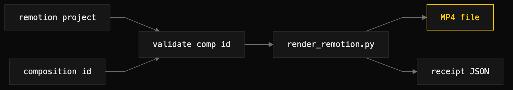

# remotion-render

> Render a Remotion composition to a video file via a thin wrapper, with a receipt beside it.



## What it does

Wraps `npx remotion render` against a project root and a composition ID, with
tier presets, composition-ID pre-validation, props materialized as a tempfile
(Windows-safe), and a structured receipt JSON. It pre-checks the composition ID
against `npx remotion compositions` so a typo is caught before the minute-scale
render starts. The wrapper also bundles `scripts/lint_remotion_spec.py`, the spec
and brand-token linter that the `remotion-author` skill uses.

## When to use it (and when NOT to)

Use it when an agent has authored or modified Remotion code and needs a real
video artifact (MP4 / WebM / ProRes / PNG sequence) for review or shipping.

Do not use it to author Remotion code (use `remotion-author`), to preview
interactively (use `npx remotion studio`), or in environments without Node on
PATH. It is local-only by design — no Lambda or cloud rendering — and it does not
run `npm install` for the target project.

## Install

```
/plugin marketplace add iksnae/skills
npx skills add iksnae/skills
npx @iksnae/skills add remotion-render
cp -R skills/remotion-render/ ~/.agents/skills/
```

## Requirements

- `npx` (Node 16+) on PATH — the wrapper exits 2 with a clear message if it is
  missing.
- `python3` — runs the bundled `scripts/render_remotion.py`.
- A Remotion project root with `package.json` and `src/`, with `node_modules/`
  already populated (`npm install` is the operator's job).
- No API keys. Local render is free; nothing is sent off-machine. The first
  render after install downloads ~150 MB of Chromium via Puppeteer.

## How it runs

1. **Confirm the project is installable.** Run `npm install` in the project root;
   the wrapper does not do this for you, and the comp-ID pre-check fails without
   `node_modules/`.
2. **Discover composition IDs (optional)** with
   `npx --yes remotion compositions <project>/src/index.ts --quiet`.
3. **Render**, resolving the script relative to the skill directory:
   ```bash
   python3 <skill-dir>/scripts/render_remotion.py \
     --project path/to/remotion-project \
     --composition MyIntro \
     --out renders/intro.mp4 \
     --tier default
   ```
   Key flags: `--props-file` (validated, hashed, passed as an absolute path),
   `--tier preview|default|max|prores-4444-xq`, `--codec`, `--concurrency`,
   `--frames START-END`, `--entry` (default `src/index.ts`),
   `--no-validate-comp-id`, `--retries`. On success the tool prints a single JSON
   line.
4. **Verify** via the receipt: `exit_code: 0` and `ok: true` mean the render
   finished cleanly; `out_size_bytes` should be sane for the duration, codec, and
   tier; `stderr_tail` carries the most informative error string on failure.
5. **Promote.** To ship a render, move it to a tracked assets directory and keep
   the receipt with your project's audit artifacts.

Match the output extension to the codec (`.mp4` for h264/h265, `.webm` for vp9,
`.mov` for prores, `.png` for png sequences), and drop `--concurrency` on
machines with under 16 GB RAM to avoid an OOM.

## Output

- The rendered video file at `<--out>`.
- A sibling receipt at `<--out>.receipt.json`, schema
  `remotion-render-receipt-v1`. Fields include `id`, `started_at` /
  `finished_at`, `duration_sec`, `ok`, `error`, `exit_code`, `tool.command`,
  `project`, `entry`, `composition`, `tier`, `tier_doc`, `codec`, `concurrency`,
  `frames`, `out`, `out_size_bytes`, `props_file` + `props_sha256` when props
  were injected, and `stderr_tail` on failure.

## Demo

The bundled linter was exercised; a full video render was not. No Remotion
project scaffold (`package.json` + `src/`) exists in this repo, which
`render_remotion.py` requires — so the demo run instead linted the title-card
spec that `remotion-author` produced.

```bash
python3 skills/remotion-render/scripts/lint_remotion_spec.py \
  --spec docs/demos/nightjar-title-card.spec.md \
  --registry docs/demos/component-registry.md
```

It reported `lint_remotion_spec: nightjar-title-card.spec.md clean` (exit 0) —
see [demos/nightjar-title-card.spec.md](demos/nightjar-title-card.spec.md). The
clean lint pass stands in as this skill's receipt; the render step itself was the
one deliberate non-run in the media demo, omitted because no project scaffold
exists to render against.

Full report: [demos/media-skills-nightjar.md](demos/media-skills-nightjar.md)
