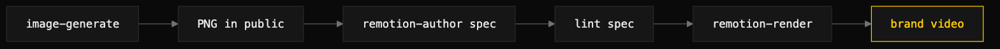

# remotion-with-image

> Chain image-generate and remotion-render so brand-aligned stills land inside a motion piece.



## What it does

A composite skill that chains three primitives: `image-generate` produces PNGs
under `<project>/public/` (any DESIGN.md/BRAND.md image-voice section
auto-injected), `remotion-author` writes a composition that loads them via
`staticFile()`, and `remotion-render` produces the MP4. Because the stills
inherit the same style brief as the composition, the final video is brand-aligned
in both static and motion layers without a separate brand pass. The
`image-generate` receipts live beside the PNGs, so every rendered video keeps a
complete audit trail of its static layers.

## When to use it (and when NOT to)

Use it when a motion piece needs hero imagery, scene backgrounds, or per-shot
illustrations that should carry the same brand voice as the surrounding
composition.

Do not use it for image-only deliverables (use `image-generate` alone), for
per-frame AI rendering (Remotion expects deterministic visuals at render time),
or for projects needing more than ~10 generated stills per minute of video — cost
compounds, so render once and reuse. Generating 1800 stills for a 60-second clip
costs roughly $72 and looks inconsistent frame-to-frame.

## Install

```
/plugin marketplace add iksnae/skills
npx skills add iksnae/skills
npx @iksnae/skills add remotion-with-image
cp -R skills/remotion-with-image/ ~/.agents/skills/
```

## Requirements

- `OPENAI_API_KEY` — required by the `image-generate` step.
- `npx` (Node 16+) on PATH — required by the render step.
- `python3` — runs `generate_image.py`, `lint_remotion_spec.py`, and
  `render_remotion.py`, each bundled in its respective sibling skill.
- A Remotion project root with `package.json` + `src/`, ideally with a central
  design-tokens module (for example `brand.ts`).

## How it runs

1. **Plan the stills.** Draft the composition spec first
   (`remotion-author` format); identify each scene that needs a still and note
   its slug and dimensions. Do not generate speculatively.
2. **Generate the stills** into `public/`:
   ```bash
   python3 <image-generate-skill-dir>/scripts/generate_image.py \
     --prompt "<what's in the image>" --size 1024x1024 --quality high \
     --out <project>/public/<slug>.png
   ```
   Any image-voice section is auto-injected. Keep the receipt beside the PNG.
3. **Reference in the composition** via `staticFile("<slug>.png")`, which
   resolves to `<project>/public/<slug>.png` at render time — never hardcode
   `public/` paths.
4. **Lint the spec** — BEATS structure, then brand tokens:
   ```bash
   python3 <remotion-render-skill-dir>/scripts/lint_remotion_spec.py --spec <spec>
   python3 <remotion-render-skill-dir>/scripts/lint_remotion_spec.py --check-tokens <project>/src
   ```
   The second call catches any hex literal that leaked outside the tokens module.
5. **Render** with `render_remotion.py --project … --composition … --out … --tier
   default`. The render does not touch the stills — they are already on disk.
6. **Verify.** Render exits 0 with receipt `ok: true`, output size is sane, and a
   `--frames=0-1` spot-check shows the first frame with the still visible and the
   brand layer consistent.

## Output

The pipeline produces an MP4 (or other codec) plus the trail of receipts that
make it auditable. It is a usable artifact when every `staticFile()` still exists
under `public/` with a sibling `image-gen-receipt-v1` receipt showing `ok: true`
and `style_injected: true`, the composition `.tsx` hardcodes no hex colors
(`--check-tokens` clean), and the render receipt has `ok: true` and
`exit_code: 0`. Cost shape: ~$0.04 per 1024×1024 high-quality still, render
itself free — a 30-second explainer with 5 generated shots is about $0.20 in
stills.

## Demo

This composite pipeline was demonstrated by its two halves rather than a single
end-to-end render, because no Remotion project scaffold exists in this repo to
render against.

The image half is shown by the repo's own hero stills, generated via
`image-generate` with the style brief auto-injected from `DESIGN.md` — both
receipts confirmed `"style_injected": true`, exactly the property this pipeline
relies on for static-layer brand consistency, at a combined ~$0.06. The
authoring-and-lint half is shown by
[demos/nightjar-title-card.spec.md](demos/nightjar-title-card.spec.md), which
linted clean (exit 0): `fps: 30`, `duration_frames: 150`, three scenes summing to
150, a single `#FFCC00` accent. Composing the two — a generated still under
`public/` referenced by a clean, token-safe spec — is exactly the workflow this
skill chains.

Full report: [demos/media-skills-nightjar.md](demos/media-skills-nightjar.md)
