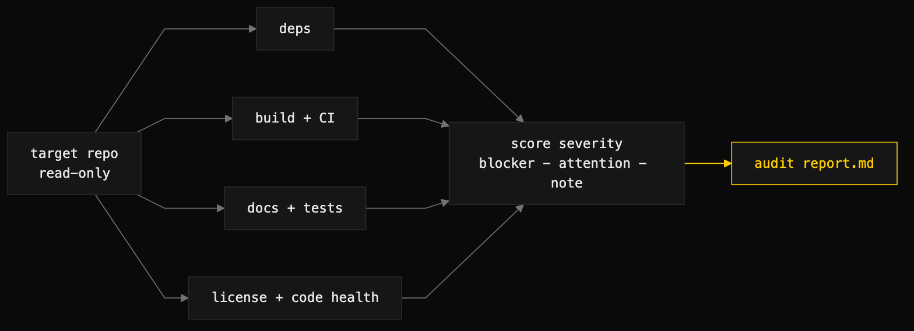

# repo-audit

> A read-only health audit of a repository — evidence-tagged findings across six domains, severity-scored, with no code changed.



## What it does

`repo-audit` produces a single markdown findings report on a repository's current state. It examines six domains — dependencies, build + CI, documentation, tests, license + governance, and surface-level code health — and writes each finding with an ID, a severity (`blocker` / `attention` / `note`), and the concrete evidence behind it (file paths, line numbers, command output). The report closes with at most five prioritized recommendations, each tied back to a finding ID.

The boundary is strict: observation only. The audit never opens PRs, pushes branches, or modifies files in the target. Remediation is explicitly separate follow-up work, and every report carries the literal statement "This audit is read-only — no code changes were proposed in this document."

## When to use it

- As the default opening move on an unfamiliar codebase: before proposing work, observe.
- Due diligence on a repository you are about to depend on, fork, or take over.
- Before roadmap planning — the audit feeds the roadmap; it is not the roadmap.

When NOT to use it: when you want code graded or scored per unit (use `certify`), when you need deep logic or security review (the audit is surface-level by design), or when the actual goal is fixing things — wanting to fix something mid-audit is the signal to end the audit and start a separate remediation task.

## Install

```
/plugin marketplace add iksnae/skills
npx skills add iksnae/skills
npx @iksnae/skills add repo-audit
# or copy skills/repo-audit/ into ~/.agents/skills/
```

## How it runs

1. **Load the template** — `references/audit-template.md` defines section order, table schemas, and the severity vocabulary; the audit works from it, not from memory.
2. **Gather observations** using only read-only operations — `gh api` for remote repos (metadata, file contents, commits, issues, PRs, releases) or direct file reads on a local checkout. No cloning unless asked.
3. **Cover six domains** — dependencies (manifests, lockfile drift, deprecated runtimes), build + CI (workflows, deprecated actions), documentation (README accuracy, LICENSE, CONTRIBUTING), tests (presence, density, CI gating), license + governance (SPDX license, CODEOWNERS), and code health (commit cadence, open issues/PRs, dormancy).
4. **Score severity per finding** — `blocker` (prevents working with the repo safely), `attention` (address soon), `note` (worth recording). A finding without evidence is a guess and does not ship.
5. **Write the report** — header metadata, per-domain finding tables, and a prioritized recommendation list (max five items, each naming the finding IDs it addresses).
6. **Self-check** — every domain has at least one finding or an explicit "No findings", every finding has an ID, every recommendation references a finding from the body.

## Output

A single markdown file (default `audit/<repo>.md`). From the nightjar run:

```markdown
| ID | Severity | Finding | Evidence |
|---|---|---|---|
| F-docs-1 | attention | README drift: the Usage section documents
  `nj rm <id>  # delete a paste`, but `main.go` has no `rm` case and
  `store.go` has no `Delete` method. | `demo/nightjar/README.md:21` vs
  `cmd/nj/main.go:23-35` (switch: add/list/get/serve only) |
```

## Demo: nightjar

The audit ran against the `demo/nightjar` subtree — a single-binary Go terminal pastebin with a CLI, an HTTP API, and a web index page, persisting pastes as one JSON file. The verdict: **has-gaps**. The code builds, vets, and tests clean with zero blockers, but the audit recorded 10 findings — 5 `attention`, 5 `note` — across build, docs, tests, and code health.

Two findings stand out for being invisible to the toolchain. F-docs-1 caught documentation drift by cross-reading the README against the source: `nj rm <id>` is documented but unimplemented, so running it prints `nj: unknown command "rm"` and exits 2. F-code-1 caught a live UI defect by reading the server code: the web index header renders a paste count cached once at startup while the table rows come from a fresh `store.Load()`, so the header and the rows diverge after every add until restart. Each finding cites file and line ranges as evidence, per the skill's "a finding without evidence is a guess" rule.

The top recommendation was structural rather than any single bug: add a CI workflow, because `.github/` does not exist and nothing enforces the currently-green `go build` / `go vet` / `go test` state on change. Five recommendations total, each mapped to finding IDs, and no code touched. Full report: [demos/repo-audit-nightjar.md](demos/repo-audit-nightjar.md)
