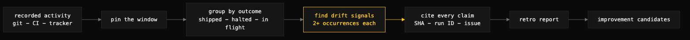

# retrospective

> Reads a project's recorded activity and reports what shipped, what halted, and the drift patterns — every claim cited, nothing speculated.



## What it does

`retrospective` turns a project's record — git history, CI runs, issue/PR trackers, or any structured event log — into an operational report: what reached a terminal success state in the window, what halted without recovery, what is still in flight, and which failure patterns recur. Recurring patterns become **drift signals**, each requiring at least two pieces of evidence (commit SHAs, run IDs, issue numbers) and each paired with a one-line improvement candidate the user can later promote to a tracked work item.

The discipline is evidence-only. If the record does not show why something halted, the report says "halt reason not recorded" — and that gap itself becomes an improvement candidate. Tone is calibrated: no celebration, no blame, observations about the system rather than the people or models running it.

## When to use it

- At the close of an iteration, sprint, release, or project phase.
- On demand, when you want to see "what's been happening" in a repo or pipeline you have been away from.
- When automated runs keep failing and you want the recurring shapes named, counted, and cited.

When NOT to use it: when there is no record to read (the retro does not synthesize from outside the evidence), when you want the fixes implemented (candidates are named, not built — promotion to tracked work is a separate step), or for assessing a repo's static health rather than its activity (use `repo-audit`).

## Install

```
/plugin marketplace add iksnae/skills
npx skills add iksnae/skills
npx @iksnae/skills add retrospective
# or copy skills/retrospective/ into ~/.agents/skills/
```

## How it runs

1. **Load the record** — a structured event log if one exists; otherwise reconstruct from `git log`, CI run history (`gh run list`), and issues/PRs updated in the window.
2. **Determine the window** — the user's since-date, or the last 100 events / last 7 days, whichever is shorter. The actual window is stated in the report; claims never generalize beyond it.
3. **Group by outcome** — shipped (terminal success), halted (failure or block without recovery), in flight.
4. **Identify drift signals** — repeated CI failures of the same shape, review-rework loops, retry caps hit, tooling misses, malformed-output failures, policy denials. Each signal needs 2+ occurrences; a single weird event is a note, not a signal.
5. **Write the report** — fixed template: summary (three sentences), shipped table, halted table with first-halt evidence, drift signal table, escalations, numbered improvement candidates referencing signal IDs.
6. **Self-check** — every shipped row appears in the record, every halted row cites its first halt, every signal cites 2+ pieces of evidence, every candidate references a signal ID.

## Output

A markdown report (default `retros/<YYYY-MM-DD>.md`, or inline). From the nightjar run:

```markdown
| ID | Signal | Frequency | Evidence | Improvement candidate |
|---|---|---|---|---|
| D-2 | A single store-layer defect propagated across every read
  surface before being caught | 4 commits / 3 surfaces | Unsorted `Load`
  introduced in `fb67ebb`; consumed unchanged by `0614b1d`, `0514eb0`,
  `0242313`; fixed centrally at `bc56a26` | Assert store-boundary
  invariants in `store` tests at scaffold time |
```

## Demo: nightjar

The retro was run against the nightjar demo build — six commits, no CI, no issue tracker — so the record was reconstructed entirely from `git log --stat`, `git show`, and `go test ./...` output. All six work items shipped (scaffold + store, CLI, HTTP API, web index, an ordering bugfix, docs); nothing halted. The report's value is in what it found between the lines of a fully green window.

Three drift signals emerged, each cited to specific SHAs. The sharpest, D-2, traced a single defect's full life: `store.Load` shipped unsorted at scaffold (`fb67ebb`), the bug rode unchanged through three read surfaces — CLI list, API list, web index — across four commits, and was finally fixed by one `sort.Slice` at the store layer (`bc56a26`), which also added the first ordering test. The report names this "the textbook argument" for its own candidate: because the defect lived at a shared boundary with no boundary test, it reached three consumers; because the boundary was shared, the fix was one line in one place.

The report also caught a regression the window never fixed: the web index caches its paste count once at startup, so the header diverges from the live rows after any add — introduced at `0242313`, still open at the window's close, escalated accordingly. Three improvement candidates close the report, each with an acceptance line and a signal ID. Full report: [demos/retrospective-nightjar.md](demos/retrospective-nightjar.md)
