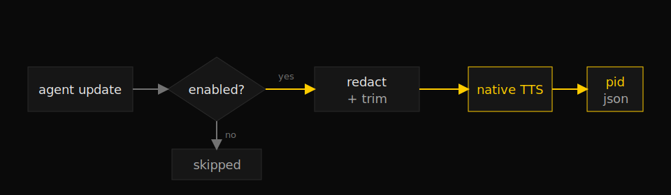

# spoken-updates

> Speak short agent progress updates aloud in the background with configurable native TTS.



## What it does

Adds a small runtime speech helper for agents. It can toggle spoken updates on
or off, configure the provider/voice/rate, and speak short status lines without
blocking ongoing work. The first implementation uses native OS TTS: macOS
`say`, Linux `spd-say` or `espeak`, and Windows `System.Speech`.

This is separate from `article-audio`: that skill creates publishable MP3 files
for long-form articles, while `spoken-updates` is for live progress narration.

## Install

```
/plugin marketplace add iksnae/skills
npx skills add iksnae/skills
npx @iksnae/skills add spoken-updates
cp -R skills/spoken-updates/ ~/.agents/skills/
```

## Configure

Speech is opt-in. The helper defaults to disabled until configured:

```bash
python3 <skill-dir>/scripts/speak_update.py config \
  --enabled \
  --provider native \
  --voice Samantha \
  --rate 185
```

Check state:

```bash
python3 <skill-dir>/scripts/speak_update.py status
```

Disable without losing voice/rate settings:

```bash
python3 <skill-dir>/scripts/speak_update.py config --disabled
```

## Speak

```bash
python3 <skill-dir>/scripts/speak_update.py speak \
  "The build is running. I will report the first failure."
```

The command returns immediately with a JSON receipt and child PID. Use `--wait`
only for verification, `--replace` to interrupt the previous helper-launched
utterance, and `stop` to end known active speech processes. Use
`--emit-command` when the agent runtime has to execute the returned playback
argv outside a sandbox to reach the audio device.

The helper redacts likely secrets, bearer tokens, private keys, and emails before
speaking. For sensitive work, keep updates high-level rather than reading exact
file paths, customer identifiers, or command output aloud.

On macOS, a managed sandbox may let `say` exit 0 without audible output, or make
`afplay` fail with `AudioQueueStart failed (-66680)`. In that case the skill is
configured correctly; run the `say` argv returned by `--emit-command` through the
host's approved unsandboxed audio path.

## Provider roadmap

Native TTS is the implemented provider. The bundled
`references/provider-options.md` compares local open-source options such as
Piper and hosted options such as OpenAI TTS, ElevenLabs, and cloud-provider TTS.
The next provider should be added one at a time, preserving native TTS as the
zero-credential fallback.
