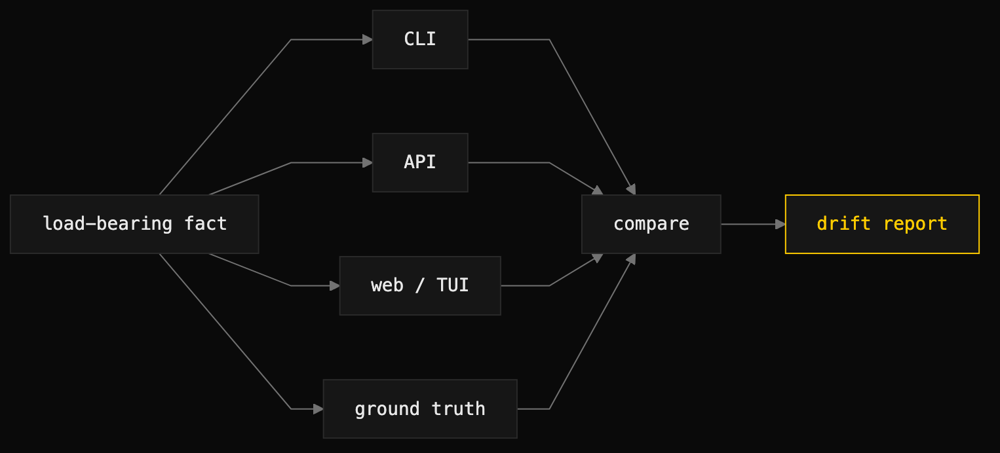

# surface-consistency-audit

> Read the same fact from every surface of an app and flag where they disagree.



## What it does

When every human view of an application is a projection of the same durable data, a load-bearing fact must read identically wherever it appears. When two surfaces disagree, one of them is lying — and a lying surface erodes trust faster than a missing feature. This skill hunts that drift.

It discovers the surfaces a target exposes — CLI commands, API endpoints, web routes or TUI screens, and where the ground truth lives — then picks each load-bearing fact, reads it from every surface, and compares. A fact is clean only when all surfaces agree; any mismatch is a finding. It names the source from a drift taxonomy: count mismatch, vocabulary drift, stale projection, or classifier disagreement.

It is a member technique of [dogfood-qa](dogfood-qa.md) and also runs standalone as a read-model truthfulness check.

## When to use it (and when NOT to)

Use it to verify read-model truthfulness — to catch duplicated items where one error renders as two, vocabulary that drifts between surfaces, stale projections served by older code, and classifier disagreements where one surface says ok and another says degraded for the same state. These are invisible to single-surface testing and to code review.

Do not use it for behavioral end-to-end QA — use [dogfood-qa](dogfood-qa.md). Do not use it for code-structure review — use a code-review skill. The audit reports observations only; it does not fix.

## Install

```
/plugin marketplace add iksnae/skills
npx skills add iksnae/skills
npx @iksnae/skills add surface-consistency-audit
# or copy skills/surface-consistency-audit/ into ~/.agents/skills/
```

## How it runs

1. **Discover the surfaces.** Enumerate the CLI, API, web/TUI, and the ground-truth data store the target exposes.
2. **Pick the load-bearing facts.** Item counts, attention or needs-action counts, current state and phase, blocked counts, spend or per-unit cost, entity names, configured-versus-observed values, health or readiness status, remote connection status.
3. **Read each fact from every surface** — the CLI status/list command, the API endpoint, the rendered web or TUI value, and the source of truth in the data.
4. **Compare.** All surfaces agree means clean; any mismatch is a finding.
5. **Name the source.** Classify each drift via the taxonomy — count mismatch, vocabulary drift, stale projection, or classifier disagreement — so the fix targets the cause, not the symptom.

## Output

A drift report listing, per discrepancy, the fact, each surface's value, the verdict, and the suspected source. Confirmed drifts graduate to issues via dogfood-qa's finding contract. From the nightjar run, the paste-count fact:

```
Ground truth (pastes.json)    4 entries
CLI  nj list footer           4 pastes
API  GET /api/pastes          "count":4
Web index — table rows        4 rows
Web index — <h1> header       2 pastes
```

## Demo: nightjar

Run against [demo/nightjar](demo-nightjar.md), the audit seeded four pastes through two surfaces — two via the CLI before the server started, two via the API after — and read each load-bearing fact from CLI, API, web, and the JSON store side by side. The most user-corrosive drift was the paste count: the web index rendered "2 pastes" in its header directly above a four-row table. Every other surface agreed on four. The header was a stale projection, a count cached once at `server.New` startup and never rebuilt, sitting inline above a fresh count from the same response.

The audit also separated genuine drift from defensible difference. The collection was named `entries` in the API JSON but "pastes" everywhere else — vocabulary drift with no canonical noun. The `created` timestamp rendered three ways: epoch int in the store and API, RFC822 in the CLI, and a date-only format on the web, with no two presentation surfaces agreeing. Snippets previewed at 40 characters with an ellipsis on the CLI versus 64 characters with no marker on the API and web. The report noted the API emitting raw epoch is a defensible machine contract — the real fault is the CLI and web disagreeing with each other.

Three facts came back clean: full paste content round-tripped byte-for-byte, IDs matched across all surfaces, and every read surface presented newest-first because they all flow through one sort. The classifier-disagreement class was marked not applicable, since nightjar exposes no health or readiness state. Full report: [demos/surface-consistency-audit-nightjar.md](demos/surface-consistency-audit-nightjar.md)
