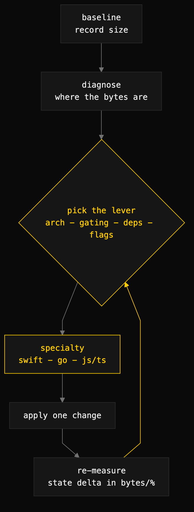

# tree-shaking

> Shrink compiled binaries the disciplined way — measure, diagnose where the bytes are, pull the highest-leverage dead-code/packaging lever, and prove the win with real before/after numbers. One skill, with per-language specialties.



## What it does

Most languages don't ship a single "tree shaking" switch. Size comes off through a *stack* of compiler, linker, and **architectural** levers — and the biggest wins are architectural, not flag-level. `tree-shaking` is the playbook for **which lever to pull, in what order, and how to prove it worked.**

The skill is structured in two layers:

- **The router (`SKILL.md`)** carries the cross-language strategy — the one idea (the toolchain keeps only the code it can reach or is forced to preserve), the universal lever taxonomy (granularity → feature gating → reachability hygiene → visibility/dependency discipline → reflection limits → release flags), and the measure → diagnose → fix → verify loop.
- **Specialties (`specialties/<lang>/`)** map that taxonomy onto a concrete toolchain: a `STRATEGY.md` with the real lever order, release flags, and diagnostic commands, plus a `GUIDE.md` mechanism deep-dive (compilation pipeline, linker reachability, ABI/CGO tradeoffs).

Today it ships **Swift**, **Go**, and **JavaScript/TypeScript** specialties; the structure is built to grow.

## When to use it

- Reducing a binary or app's size, or "tree shaking" a target.
- Auditing why a build is large and attributing the bytes.
- Choosing static vs dynamic linking, gating optional subsystems, trimming dependencies, or setting release optimization flags.
- Designing a new module/package graph to *be* tree-shakeable from the start.

When NOT to use it: runtime-speed-only tuning unrelated to size.

## Install

```
/plugin marketplace add iksnae/skills
npx skills add iksnae/skills
npx @iksnae/skills add tree-shaking
# or copy skills/tree-shaking/ into ~/.agents/skills/
```

## How it runs

1. **Pick the lever altitude.** Architecture and feature gating first (they unlock the most), dependency/visibility hygiene second, release flags and micro-attributes last.
2. **Dispatch to the specialty.** Read `specialties/<lang>/STRATEGY.md` for the language's concrete lever order, flags, and commands; open the co-located `GUIDE.md` when you need the mechanism.
3. **Run the loop.** Baseline → diagnose where the bytes are → apply one lever → re-measure → repeat. One change at a time so each delta is attributable.
4. **Report in real numbers.** State the size win in bytes/% against the recorded baseline — never claim a win you didn't measure.

## Specialties

| Language | Strategy | Mechanism |
|---|---|---|
| Swift | `skills/tree-shaking/specialties/swift/STRATEGY.md` | `.../swift/GUIDE.md` |
| Go | `skills/tree-shaking/specialties/go/STRATEGY.md` | `.../go/GUIDE.md` |
| JavaScript / TypeScript | `skills/tree-shaking/specialties/js/STRATEGY.md` | `.../js/GUIDE.md` |

## Adding a language

The layout is an explicit expansion contract. To add `<lang>`: create `specialties/<lang>/STRATEGY.md` (lever order, workflow with concrete commands, release flags, anti-patterns, pre-ship checklist) and `specialties/<lang>/GUIDE.md` (the mechanism), then add a row to the router's Specialties table. Specialty files carry no YAML frontmatter and are never named `SKILL.md` — only the router registers as a skill, so the skill stays singular.
