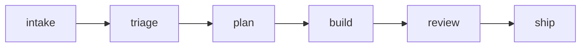

# illustrate-doc

The canonical decision skill for "should this doc have an image?"
and "which tool produces it?" Other doc-producing skills reference
this one rather than restating the rules.

## Purpose and boundaries

This skill commits to:

- A single decision tree for image vs no-image, with explicit
  criteria.
- A tool-selection rule that defaults to **Mermaid** (free,
  rendered by GitHub natively, structurally accurate by
  construction) and escalates to image-generate only when brand
  voice or pictorial content is the load-bearing concern.
- Pointers to the three primitives that already exist:
  - [`image-generate`](../image-generate/SKILL.md) — OpenAI image
    API via its bundled `scripts/generate_image.py`.
  - [`remotion-with-image`](../remotion-with-image/SKILL.md) — when
    the visual needs motion.
  - Raw Mermaid in a `mermaid` fence — the default and the cheapest.

It does NOT commit to:

- Producing any artifact itself. Methodology only.
- Generating images speculatively. Always tied to a concrete doc
  the agent is already authoring.
- Overriding the author's judgment when they choose to ship a long
  planning doc without a visual.

## The cardinal rule

> **If the concept has structural geometry that prose has to
> reconstruct, the diagram pays compounding interest. If the
> concept is a list, a comparison, or a single claim, prose is
> the right tool.**

Structural geometry: timeline, phases, dependencies, hierarchy,
state machine, swim lanes, decision tree, fan-out / fan-in,
comparison matrix with > 4 axes.

List-shaped: requirements, risks, follow-ups, acknowledgements,
acceptance criteria, single-axis rankings, "what we shipped."

The line is not always clean. Defaults below resolve the gray zone.

## Decision tree

```
Is the artifact a planning / synthesis / architecture doc?
├── No (PR review, dependency bump, cover letter, short brief)
│   └── No image. Prose is fine.
└── Yes
    │
    ├── Is the doc < 400 words?
    │   └── No image. The doc is short enough to read end-to-end.
    │
    ├── Is there a single structural geometry the prose keeps
    │   reconstructing? (timeline, phase graph, state machine,
    │   dependency tree, swim lanes)
    │   ├── Yes → Mermaid (default).
    │   └── No → consider an image-generate hero IF the doc has
    │            an opening that benefits from brand presence
    │            (kickoff documents, retro covers, public-facing
    │            briefs). Otherwise: no image.
    │
    └── Is the content pictorial?  (UI mockup, hero shot, story
        card, screenshot composite)
        └── image-generate. If your project keeps an image-voice
            section in DESIGN.md/BRAND.md, the prefix is
            auto-injected so the result reads on-brand.
```

## Tool selection

| Need | Tool | Cost | When |
|---|---|---|---|
| State machine, sequence, flowchart, ER, gantt | Mermaid in `mermaid` fence | $0 | Default for any structural diagram. Renders natively in GitHub and most markdown viewers. |
| Hero image, story card, brand-aligned still | [`image-generate`](../image-generate/SKILL.md) `scripts/generate_image.py` (`--prompt`) | ~$0.04–0.06 | Opening of a public-facing doc, news graphic, kickoff cover. Any DESIGN.md/BRAND.md image-voice section auto-injects. |
| Diagram that needs brand polish | [`image-generate`](../image-generate/SKILL.md) `scripts/generate_image.py` (`--mermaid path.mmd`) | ~$0.04–0.06 | When a structural diagram will be embedded in a high-visibility doc and the kroki baseline alone reads off-brand. |
| Motion clip with brand voice | [`remotion-render`](../remotion-render/SKILL.md) `scripts/render_remotion.py` + [`remotion-with-image`](../remotion-with-image/SKILL.md) | $0 render + image gen cost | Animated brand intros, story cards, multi-scene narratives. |

**Default to Mermaid.** Reach for image-generate when one of:

- The doc is operator- or client-facing AND benefits from a brand-
  voiced opening (a README org chart or architecture hero is the
  model).
- The geometry is too complex for Mermaid to render legibly (rare
  — Mermaid handles graphs up to ~50 nodes well).
- The visual carries narrative weight beyond structure (story-card
  compositions are the canonical example).

Don't reach for image-generate when:

- The doc is internal-only and short.
- The geometry is a list-with-arrows (Mermaid is strictly better
  here).
- The brand voice would distract (pure technical reference — a
  layered-architecture diagram in Mermaid is usually enough).

## Workflow

### Step 1: Identify the structural concept

While authoring the doc, name aloud (in a comment, the spec, or
your own scratch) the one geometric concept the doc most relies
on. If you can't, the doc probably doesn't need an image.

### Step 2: Try Mermaid first

Author the diagram as a `mermaid` fence in the doc directly:

````markdown

````

Preview it. If the rendering is legible and the concept comes
through, you're done. Cost: zero.

### Step 3: Escalate to image-generate (only if needed)

Only if the Mermaid output reads off-brand for the surface, or
the concept is pictorial:

```bash
# Structural diagram with brand polish
python3 <image-generate-skill-dir>/scripts/generate_image.py \
  --mermaid path/to/diagram.mmd \
  --out docs/assets/<slug>.png

# Pictorial / hero
python3 <image-generate-skill-dir>/scripts/generate_image.py \
  --prompt "<subject — any configured style brief auto-injects>" \
  --size 1536x1024 \
  --out docs/assets/<slug>.png
```

Generated PNGs default to `generated-images/` when `--out` is
omitted; for committed docs, write (or move) them into a tracked
assets directory and reference them from the doc:

```markdown

```

### Step 4: Review the doc

Re-read the doc with the image in place: long planning artifacts
(≥600 words) that describe structural concepts and ship with no
inline image or Mermaid fence deserve a second look — but the
final call is the author's.

## Failure modes to avoid

- **Decorating every doc.** Image-fatigue is real. If every
  retro starts with a hero image and every audit ends with one,
  the imagery stops carrying meaning. Reserve hero images for
  surfaces that earn them.
- **Mermaid as a "diagram filler".** A Mermaid block that just
  visualizes the doc's own bulleted list adds nothing. The
  diagram should show geometry the bullets can't.
- **Image-generate for pure structure.** If you can render it in
  Mermaid, do. The kroki baseline is structurally accurate by
  construction; LLM polish can rearrange nodes.
- **Referencing untracked image paths in committed docs.** Always
  move generated PNGs into a tracked assets directory before
  committing the doc that references them.
- **Skipping `--check-tokens` after a Remotion edit.** When you
  illustrate via Remotion and your project centralizes design
  tokens, run the bundled linter
  (`<remotion-render-skill-dir>/scripts/lint_remotion_spec.py
  --check-tokens <src>`) before the render is final.

## Verification

The doc is illustrated when:

- The image (Mermaid block or rendered PNG) sits inline with
  the prose that names the concept — not at the bottom as
  decoration.
- The geometry in the image matches what the prose claims.
- A receipt exists beside any image-generate output — the audit
  trail of "this is how the image was produced".

## References

- Sister skills:
  [`image-generate`](../image-generate/SKILL.md),
  [`remotion-with-image`](../remotion-with-image/SKILL.md),
  [`remotion-author`](../remotion-author/SKILL.md).
- Brand voice: an optional DESIGN.md/BRAND.md in your project —
  an image-voice section (consumed by image-generate), Remotion
  authoring conventions, and when-to-illustrate guidance all
  belong there.
